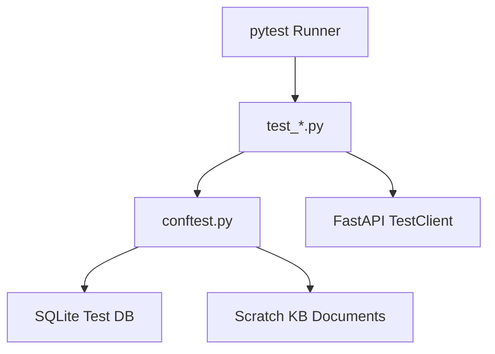

# voiceService Testing Guide & Specifications

This document outlines the testing architecture, database constraints, mocking strategies, and guidelines/templates for writing and adding new tests to the `voiceService` repository.

---

## 1. Testing Architecture Overview

The `voiceService` testing framework is built on **pytest** and integrates with **FastAPI's TestClient**, **SQLite**, and **ChromaDB**.



### Key Components:
- **Test Database**: Located in the sandbox-permitted scratch directory at `/Users/rohanroy/.gemini/antigravity-ide/scratch/test_voice_service.db`. It is set via the `DATABASE_URL` environment variable during test sessions.
- **Knowledge Base (KB) Redirection**: The global `KB_DIR` is redirected to `/Users/rohanroy/.gemini/antigravity-ide/scratch/test_kb_documents` to satisfy write permissions.
- **Sandbox Protections**: To prevent process blocks in restricted execution sandboxes, Python bytecode generation is disabled (`sys.dont_write_bytecode = True`) and pytest cache is routed to the scratch directory.

---

## 2. Testing Guidelines & database Conventions

### 2.1 Database Seeding
The database is seeded **once per test session** using the `setup_and_cleanup_test_db` fixture in `conftest.py` (which runs `seed_db()`).

> [!WARNING]
> Because the database is shared across all tests in the session, any side-effects (such as deleting records or modifying service items) must be cleaned up at the end of each test to avoid polluting subsequent tests.

### 2.2 Foreign Key Constraints
The database enforces foreign key constraints (`ON DELETE CASCADE` or `RESTRICT`).
- When deleting test objects, ensure you do not violate `RESTRICT` dependencies.
- **Good Practice**: Use unique mock IDs (e.g., customer `1500`, service request `5000`) instead of low numbers to prevent collision with other fixtures.

---

## 3. Mocking Strategies

All tests must run without external network dependency. Use Python's built-in `unittest.mock` for stubbing:

### 3.1 Google Calendar Mocking
Instead of checking live calendar data, mock the Google APIs and tokens:
```python
from unittest.mock import patch

@patch("serviceBot.services.google_calendar.fetch_agent_events")
def test_my_calendar_check(mock_fetch):
    # Mock return list of Google events
    mock_fetch.return_value = [{"id": "evt1", "status": "confirmed", ...}]
```

### 3.2 Gmail/SMTP Mocking
Avoid sending real emails. Stub email dispatch functions:
```python
@patch("serviceBot.services.gmail.send_gmail_api_email")
def test_notification(mock_send):
    mock_send.return_value = True
```

---

## 4. Running the Tests

To launch the test suite cleanly inside or outside agent sandboxes, use the provided `run_tests.sh` script:

```bash
# Run all tests
bash run_tests.sh

# Run specific service tests
bash run_tests.sh --service encryption
bash run_tests.sh --service calendar_sync
bash run_tests.sh --service gmail
bash run_tests.sh --service google_calendar
bash run_tests.sh --service rag
```

---

## 5. Guide for Adding New Tests

Follow these steps to add a new test file:

1. **Bootstrap the File**:
   Run the test runner with `--create <name>` to bootstrap a new test template:
   ```bash
   bash run_tests.sh --create my_new_feature
   ```
   This creates `tests/test_my_new_feature.py`.

2. **Template Structure**:
   Use the template below for writing tests:

```python
import pytest
from unittest.mock import patch, MagicMock
from serviceBot.db.connection import get_db_connection

def test_feature_logic():
    """Verify that feature logic functions correctly."""
    # 1. Setup mock database records
    with get_db_connection() as conn:
        cursor = conn.cursor()
        cursor.execute("INSERT OR IGNORE INTO customers (id, name, phone) VALUES (8888, 'John Doe', '5551231234');")
        conn.commit()

    try:
        # 2. Run your assertion
        assert True
    finally:
        # 3. Clean up database state
        with get_db_connection() as conn:
            cursor = conn.cursor()
            cursor.execute("DELETE FROM customers WHERE id = 8888;")
            conn.commit()
```

3. **Verify Execution**:
   Run pytest against your new test using the runner:
   ```bash
   bash run_tests.sh --service my_new_feature
   ```
