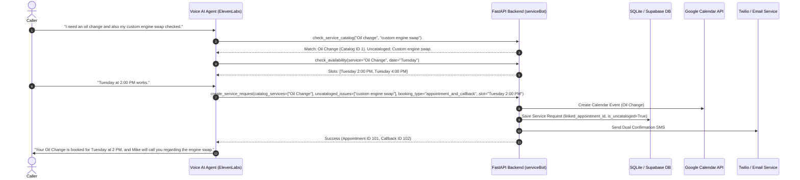

# Feature Specification: Uncataloged Issue Callback & Dual-Intake Routing

**Document Version:** 1.2  
**Status:** Approved for Implementation  
**Target Module:** `serviceBot` AI Voice Agent, API Server, Database, Admin Web Portal  

---

## 1. Executive Summary & Value Proposition

### 1.1 Problem Statement
In real-world service businesses (automotive repair, HVAC, medical/dental, specialized maintenance), customers frequently call regarding issues, custom requests, or diagnostic symptoms that do not exist in the standardized service catalog (e.g., *"My 1972 Mustang needs custom carburetor tuning"*, *"Engine makes an intermittent whistling sound when turning left"*).

Currently, if an inbound caller mentions an uncataloged issue:
1. The AI voice agent risks force-fitting the request into an incorrect standard catalog item (e.g., booking a 30-minute oil change slot for a 4-hour diagnostic job).
2. The AI agent might fail to assist the customer, leading to dropped calls, caller frustration, and lost business revenue.
3. For callers with **mixed intents** (e.g., requesting a standard catalog service *AND* reporting an uncataloged issue), current systems struggle to handle both booking an appointment and capturing a technical callback ticket in a single voice interaction.

### 1.2 Proposed Solution
Implement **Uncataloged Issue Callback & Dual-Intake Routing** in `voiceService`:
- **Uncataloged Triage**: When the AI voice agent detects an issue not matching the business service catalog, it automatically offers and creates a prioritized **Generic Callback Request** for technical advisor review.
- **Dual-Intake (Appointment + Callback)**: When a caller requests both catalog items and uncataloged issues in the same conversation, the agent handles both seamlessly during the live call — booking the Google Calendar appointment for catalog item(s) AND attaching a Callback Request for the uncataloged issue.
- **Staff Portal Triage**: Flag uncataloged issue callbacks with an *"Unlisted Issue / Advisor Review Required"* tag in the admin web portal.

### 1.3 Target Personas
- **Inbound Caller / Customer**: Receives immediate, professional handling of custom issues without being turned away or forced into improper booking slots.
- **AI Voice Agent**: Dynamically classifies intent, manages dual tool calls, and provides transparent confirmation.
- **Business Owner / Service Advisor**: Gains structured visibility into custom/diagnostic work before customer arrival, protecting shop schedule integrity.

---

## 2. User Stories & Acceptance Criteria

### User Story 1: Pure Uncataloged Issue Intake
> **As an** inbound caller with a custom or uncataloged vehicle issue,  
> **I want** the AI agent to capture my specific vehicle and symptom details and schedule an expert callback,  
> **So that** a service advisor can evaluate my request without me having to wait on hold or call back multiple times.

#### Acceptance Criteria:
- **AC 1.1**: The AI agent checks the service catalog via `check_service_catalog`. If confidence is below threshold or no match exists, it transparently states that custom advisor evaluation is required.
- **AC 1.2**: The agent collects customer name, phone number, vehicle details (Year/Make/Model), and a detailed issue description.
- **AC 1.3**: The agent invokes `create_service_request` with `booking_type="callback"` and `is_uncataloged=True`.
- **AC 1.4**: The caller receives a voice confirmation and an automated SMS/email confirmation containing the callback ticket ID and expected response window.

---

### User Story 2: Dual-Intake (Catalog Appointment + Uncataloged Callback)
> **As an** inbound caller needing a standard service (e.g., Oil Change) AND an uncataloged repair (e.g., custom rattle diagnosis),  
> **I want** the AI agent to book my appointment slot and register my callback ticket in a single phone call,  
> **So that** both my routine maintenance and custom diagnostic needs are handled seamlessly.

#### Acceptance Criteria:
- **AC 2.1**: The AI agent identifies standard catalog items and uncataloged diagnostic issues from the caller's utterance.
- **AC 2.2**: The agent checks slot availability via `check_availability` for the catalog item and books the Google Calendar slot via `create_service_request`.
- **AC 2.3**: The agent registers the uncataloged issue callback linked to the same customer/vehicle and newly created appointment (`linked_appointment_id`).
- **AC 2.4**: The agent verbally confirms both outcomes before call wrap-up (*"I've booked your Oil Change for Tuesday at 2 PM and flagged the rattle for our master technician to call you beforehand"*).

---

### User Story 3: Admin Web Portal Visibility & Triage
> **As a** shop owner or service advisor,  
> **I want** uncataloged callbacks clearly highlighted on my dashboard with SLA timers,  
> **So that** my team can review technical notes and call the customer back before their scheduled visit.

#### Acceptance Criteria:
- **AC 3.1**: The Admin Web Portal displays an *"Unlisted Issue"* badge on all service requests marked `is_uncataloged=True`.
- **AC 3.2**: Service requests with `booking_type="appointment_and_callback"` show linked appointment details and callback priority status.
- **AC 3.3**: Staff members can update callback status (`pending_triage`, `completed`, `cancelled`) directly from the portal UI.

---

## 3. System Architecture & Component Impact



### 3.1 Database Schema Updates (`serviceBot/db/`)
Update the `service_requests` table schema in SQLite / PostgreSQL:

```sql
ALTER TABLE service_requests ADD COLUMN is_uncataloged BOOLEAN DEFAULT FALSE;
ALTER TABLE service_requests ADD COLUMN linked_appointment_id INTEGER DEFAULT NULL REFERENCES service_requests(id);
ALTER TABLE service_requests ADD COLUMN callback_priority VARCHAR(20) DEFAULT 'medium';
ALTER TABLE service_requests ADD COLUMN callback_number VARCHAR(50) DEFAULT NULL;
ALTER TABLE service_requests ADD COLUMN triage_lock_owner INTEGER DEFAULT NULL REFERENCES staff_agents(id);
ALTER TABLE service_requests ADD COLUMN triage_lock_expires REAL DEFAULT NULL;
ALTER TABLE service_requests ADD COLUMN triage_history TEXT DEFAULT NULL;

-- Expand booking_type validation
-- Allowed values: 'appointment', 'callback', 'appointment_and_callback', NULL
```

### 3.2 API Contracts (`serviceBot/api/`)
Update `POST /api/service-requests/` and ElevenLabs tool definitions:

#### Extended Request Payload:
```json
{
  "customer_phone": "+15551234567",
  "callback_number": "+15559876543",
  "customer_name": "Sarah Johnson",
  "vehicle_details": {
    "make": "Ford",
    "model": "Mustang",
    "year": 1972
  },
  "catalog_service_ids": [1],
  "uncataloged_issues": [
    "Custom carburetor tuning and performance exhaust leak check"
  ],
  "booking_type": "appointment_and_callback",
  "time_slot": "2026-08-04T14:00:00Z",
  "callback_priority": "high"
}
```

### 3.3 AI Voice System Prompt Rules (`serviceBot/system_prompt.txt`)
Add strict intake guidelines to the system prompt:
1. **Catalog Verification**: Never guess or force an uncataloged symptom into a standard catalog service.
2. **Dual-Intake Execution**: When caller presents both catalog items and custom symptoms, execute appointment booking first, followed by callback registration.
3. **Voice Transparency**: Explicitly inform the caller about the separate callback step for unlisted items so expectations are clear.
4. **Preferred Callback Number Clarification**: Always ask the caller if the inbound phone number is the best number for the advisor to call back on.

---

## 4. Hardened Real-World Edge Cases & Failure Modes

### 4.1 Intake & Communication Edge Cases

| ID | Trigger / Scenario | Risk / Impact | Mitigation / Fallback Strategy |
|:---|:---|:---|:---|
| **4.1.1** | **Ambiguous / Garbled Customer Description** | Customer gives unclear input (*"Car makes funny noise"*). | Agent asks 1 clarifying question (*"When do you hear it — when turning, braking, or idling?"*) before capturing description. |
| **4.1.2** | **Caller Demands Instant Price Quote for Uncataloged Item** | No fixed price exists for custom diagnostic work. | Agent explains: *"Because this requires custom technical evaluation, our advisor needs to assess it to give an accurate quote. May I schedule a callback?"* |
| **4.1.3** | **After-Hours / Holiday Callback Requests** | Customer calls on weekend or holiday; agent promises immediate callback. | Dynamic operating hours check in prompt. Agent states: *"Our shop is currently closed. An advisor will call you back on our next business day, Monday morning after 8:30 AM."* |
| **4.1.4** | **Call Drop Recovery (Partial Capture)** | Call disconnects abruptly during custom symptom intake. | Create database request record in `draft` state during call streaming. If disconnect occurs, trigger SMS: *"We noticed our call dropped. We saved your request regarding [captured symptoms]. Reply to confirm callback."* |
| **4.1.5** | **Low-Confidence Fuzzy Catalog Matching** | AI matches custom symptom with catalog service at low confidence (<60%). | Multi-threshold matching. For medium confidence, agent asks: *"It sounds like you need Brake Service. Should I book that, or is it a different issue?"* Low confidence automatically triggers generic callback routing. |
| **4.1.6** | **Preferred Callback Number Discrepancy** | Caller is using a work line but wants callback on mobile. | Agent explicitly verifies callback contact number: *"Should we reach you back at [Inbound Number], or is there a better callback number?"* |
| **4.1.7** | **TCPA & SMS Opt-In Compliance** | Regulatory violation for automated notifications. | Verbal consent verification step on call: *"Is it okay to send automated text updates about your callback to this number?"* Consent flag recorded in DB. |
| **4.1.8** | **Conversational Symptom Loop (Rambling Customer)** | Caller lists 10 separate minor issues, confusing the agent. | Prompt instructs agent to synthesize complaints into a single structured description payload instead of creating separate requests. |
| **4.1.9** | **Out-of-Scope / Spam Request Intake** | Caller asks for services business doesn't support (e.g. plumbing call to auto shop). | Agent matches keywords against an out-of-scope domain list and politely rejects: *"I apologize, but we only service light trucks and passenger cars. We cannot schedule a callback for plumbing."* |

---

### 4.2 System & Lifecycle Edge Cases

| ID | Trigger / Scenario | Risk / Impact | Mitigation / Fallback Strategy |
|:---|:---|:---|:---|
| **4.2.1** | **Appointment Booked but Callback Save Fails** | Inconsistent database state; callback details lost. | Atomic Database Transaction: Both appointment slot allocation and callback ticket creation are wrapped in a single database transaction block. If either fails, roll back both. |
| **4.2.2** | **Double Booking & Duplicate Callback Requests** | Caller calls twice in 10 minutes, generating multiple identical callbacks. | Pre-call lookup for open callback tickets with status `pending_triage` from the same phone number. Agent states: *"I see we already have a callback request for your engine noise. I'll add these new details to your existing ticket."* |
| **4.2.3** | **Cascade Rescheduling & Cancellation** | Customer cancels/reschedules the linked appointment. | **Cancellation**: System asks customer/advisor whether to retain the callback. By default, the callback remains active in `pending_triage`. **Rescheduling**: Bumps callback priority if the rescheduled appointment date is closer than the original. |
| **4.2.4** | **Uncompleted Callback SLA vs. Scheduled Slot** | Appointment arrives in 24 hours but advisor hasn't processed the callback. | If callback is still `pending_triage` 24 hours prior to appointment slot, auto-promote priority to `Urgent` and push a high-priority Slack/email alert to the service manager. |
| **4.2.5** | **Multi-Service Duration Bottle-Neck** | Booking oil change + diagnostics blocks a short window. | Default Diagnostic Buffer: The booking engine automatically appends a standard diagnostic buffer (e.g., 30-minute block) to the appointment duration to prevent bay conflicts. |
| **4.2.6** | **Advisor Callback Collision** | Two service advisors open the dashboard and call the customer simultaneously. | Optimistic locking on portal: When an advisor clicks "Call Customer," API flags request as `triage_lock_owner` with a 15-minute lease expiration. Other advisors see the record locked in real time. |
| **4.2.7** | **Customer No-Answer / Voicemail on Callback** | Advisor calls back but customer line is busy or goes to voicemail. | Portal has "Voicemail Left" action button. Clicking triggers automated SMS: *"Hi [Name], we tried calling you about your custom request. Please call us back or let us know a better time!"* Updates status to `voicemail_left` and queues retry. |
| **4.2.8** | **Part Ordering & Pre-Diagnostic Context** | Advisor calls customer back but lacks part availability/pricing data. | Backend pre-queries parts supplier APIs for key terms found in `uncataloged_issues` description (e.g. "clutch", "alternator") and embeds estimated parts/cost options directly in the advisor's dashboard view. |

---

## 5. Success Metrics & Telemetry

| Metric | Target | Measurement Method |
| :--- | :--- | :--- |
| **Unlisted Issue Conversion Rate** | >95% | % of uncataloged caller intents successfully converted to registered callbacks without dropped calls |
| **Dual-Intake Completion Rate** | >90% | % of calls with mixed intents (catalog + uncataloged) that complete both appointment & callback creation |
| **Catalog Misclassification Rate** | <2% | % of uncataloged issues accidentally forced into standard catalog slots |
| **Advisor Callback SLA Compliance** | >85% | % of uncataloged callbacks completed by staff within 2 business hours |
| **Duplicate Ticket Rate** | <1% | % of callback requests flagged as duplicate entries by the system |
| **Draft Recovery Success Rate** | >20% | % of dropped-call drafts successfully converted into active callback tickets via recovery SMS |

---

## 6. Implementation & Phased Rollout Plan

### Phase 1 (MVP)
- Update SQLite database schema (`is_uncataloged`, `linked_appointment_id`, `booking_type` enum).
- Update FastAPI endpoints and ElevenLabs tool definitions for dual-intake payload.
- Update `system_prompt.txt` with uncataloged triage and dual-intake dialogue patterns.
- Implement basic Web Portal "Unlisted Issue" badge rendering.

### Phase 2 (Enhancements & Hardening)
- Implement Portal SLA timers for overdue callbacks.
- Add AI-driven catalog expansion suggestions (identifying top uncataloged callback descriptions to recommend adding to the permanent service catalog).
- Add automated SMS reminder to customer if staff callback is delayed.
- Enable duplicate callback detection and cascade cancellation checks.
