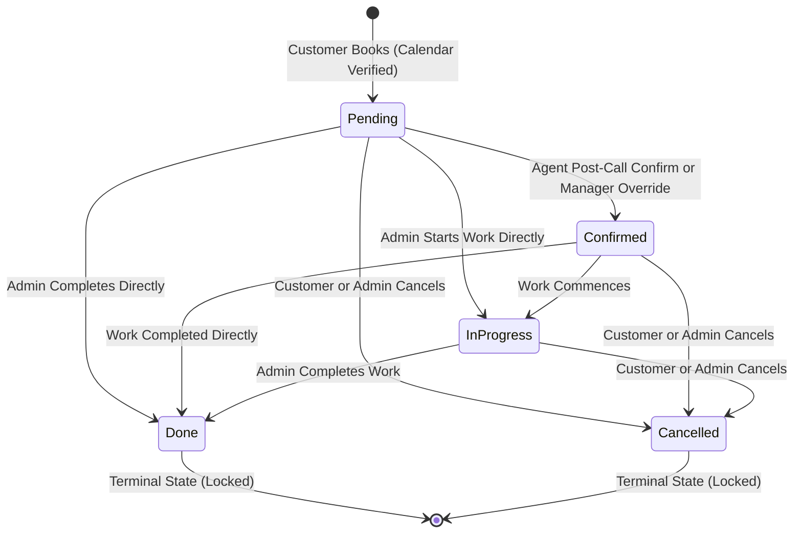
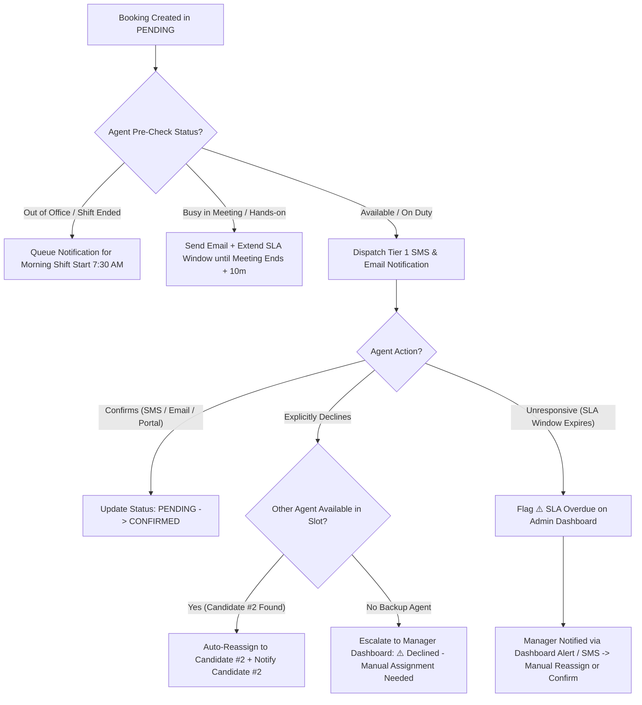

# Product Requirement Document (PRD): Service Request Status & Agent Confirmation Workflow

**Document Version:** 1.2  
**Status:** Approved for Engineering Implementation  
**Target Subsystem:** `serviceBot` AI Voice Agent, API Gateway, Background Worker, Portal Frontend  
**Location:** `docs/prd/serviceRequest_status/service_request_status_workflow_prd.md`  

---

## 1. Executive Summary & Value Proposition

### 1.1 Problem Statement
In the current Admin Web Portal, service request statuses operate as unrestricted, unstructured CRUD fields. Support agents can change statuses between any values (e.g. `done` → `pending`), violating standard operational lifecycles and creating audit anomalies. Additionally, confirmation depended heavily on customer SMS loops, while staff agents lacked a structured post-call confirmation mechanism. This results in:
1. **Accidental status changes** in the dashboard due to single-click/scroll events.
2. **Calendar slot allocation issues** due to unconfirmed appointments blocking slots.
3. **No-shows and lost revenue** because assigned staff agents are unaware of booking requests until the customer arrives.

### 1.2 Proposed Solution & Strategic Alignment
1. **Calendar Availability as Primary Truth**: Real-time Google Calendar availability (`calendar_sync`) is verified during the incoming AI call. Slot verification guarantees the appointment immediately, creating the request in `pending` status.
2. **Frictionless Customer Onboarding**: Since customers verbally confirm during the AI voice call, requiring a secondary SMS reply adds unnecessary drop-off. Instead, customers receive an instant confirmation SMS with a simple self-service cancellation option (*"Reply CANCEL to cancel anytime"*).
3. **Mandatory Post-Call Agent Confirmation Loop**: The assigned staff agent receives a post-call notification (SMS, Email, or Portal) to acknowledge/accept the booking, advancing the status from `pending` → `confirmed`.
4. **Unconfirmed Agent Decision Engine**: A robust decision tree handles real-world operational scenarios (Out of Office, Busy in Meeting, SLA Timeouts, Explicit Declines) with automatic Candidate #2 reassignment and Manager Dashboard escalation.
5. **Minimalist UI & FSM Enforcement**: Transparent word-colored badges replace heavy background pills, and a modal prompt prevents accidental misclicks in table rows.

---

## 2. Target Personas & User Journeys

### 2.1 Personas
* **Customer (e.g., David)**: Books a callback or appointment via AI voice call. Wants immediate verification of his slot, a text summary, and an easy way to cancel if his plans change.
* **Staff Agent (e.g., Sarah)**: A busy technician or service advisor. Needs a frictionless, non-intrusive way to review and accept incoming assignments without interrupting her hands-on work.
* **Shop Manager (e.g., Mike)**: Oversees shop floor operations, ensures technician utilization is optimized, and manually steps in to re-assign bookings if a technician declines or misses an SLA window.

### 2.2 User Stories

#### User Story 1: Customer Intake & Instant Confirmation SMS
> **As a** customer booking an appointment or callback via the AI voice agent,  
> **I want my slot** verified against real calendar availability and confirmed instantly without requiring a follow-up confirmation text,  
> **So that** I know my booking is secured immediately before hanging up the phone.
* **Acceptance Criteria (AC 1.1)**: System queries Google Calendar free/busy status. If available, request is created in `pending` status.
* **Acceptance Criteria (AC 1.2)**: Customer receives an instant SMS summary containing the booking ID, date, time, and instructions to cancel.
* **Acceptance Criteria (AC 1.3)**: The SMS contains the cancellation option: *"Reply CANCEL to cancel anytime"*.

#### User Story 2: Post-Call Agent Confirmation Loop
> **As an** assigned staff agent,  
> **I want** to receive a post-call notification (SMS, Email, or Portal) to accept my new assignment,  
> **So that** the request is advanced to `confirmed` status without manual portal administration.
* **Acceptance Criteria (AC 2.1)**: Post-call, agent receives an SMS (*"New Request #102. Reply CONFIRM or DECLINE"*) and Email containing magic acceptance links.
* **Acceptance Criteria (AC 2.2)**: Replying `CONFIRM` or clicking the Email accept button changes request status from `pending` → `confirmed`.
* **Acceptance Criteria (AC 2.3)**: Replying `DECLINE` or clicking the decline link triggers the reassignment engine.

#### User Story 3: Unconfirmed Agent Reassignment & Dashboard Alert
> **As a** Shop Manager,  
> **I want** the system to automatically reassign declined requests to another available agent or escalate SLA timeouts to my dashboard,  
> **So that** no customer booking is forgotten or dropped.
* **Acceptance Criteria (AC 3.1)**: If an agent declines, the system queries available agents for that slot and automatically reassigns to **Candidate #2**.
* **Acceptance Criteria (AC 3.2)**: If no backup agent is available or the SLA timeout expires, the request is flagged with a **`⚠️ SLA Overdue`** alert on the Manager Dashboard, and the Manager (admin) is alerted via SMS and email.
* **Acceptance Criteria (AC 3.3)**: The manager has one-click reassignment capability via a pre-filtered dropdown showing only available agents for that slot.

#### User Story 4: Manager Reassignment of Confirmed Requests
> **As a** Shop Manager,  
> **I want** to be able to reassign an already `confirmed` (or `pending`) request to a different available agent,  
> **So that** I can handle day-of sick leaves or schedule changes without reverting the request status.
* **Acceptance Criteria (AC 4.1)**: Manager can select a new agent from the UI for a `confirmed` request.
* **Acceptance Criteria (AC 4.2)**: The previous agent receives an SMS notifying them they have been unassigned (only when directly removed).
* **Acceptance Criteria (AC 4.3)**: The newly assigned agent receives standard assignment notifications.
* **Acceptance Criteria (AC 4.4)**: The customer does **not** receive a notification about the internal agent swap to avoid information overload.

---

## 3. Minimalist Status Lifecycle & State Definitions

The system simplifies all service request operations into **5 Core Statuses**:

| Status | Minimalist Word Color | Operational Meaning & Trigger | Allowed Next States |
| :--- | :--- | :--- | :--- |
| **`pending`** | 🟡 **Yellow** (`#f59e0b`, transparent bg) | **Booked / Awaiting Agent Confirmation**. Assigned on call after Google Calendar slot check succeeds. | `confirmed`, `in_progress`, `done`, `cancelled` |
| **`confirmed`** | 🩵 **Cyan/Teal** (`#06b6d4`, transparent bg) | **Agent Accepted**. Triggered when agent confirms assignment (via SMS reply, Email click, or Manager Override). | `in_progress`, `done`, `cancelled` |
| **`in_progress`** | 🔵 **Blue** (`#3b82f6`, transparent bg) | **Work Underway**. Staff/technician has actively started working on the appointment or callback. | `done`, `cancelled` |
| **`done`** | 🟢 **Green** (`#10b981`, transparent bg) | **Completed**. Service request or callback is fully finished. | **Terminal State** *(Locked - Slot retained for history)* |
| **`cancelled`** | 🔴 **Red** (`#ef4444`, transparent bg) | **Cancelled**. Cancelled by customer SMS (`CANCEL` reply), phone call, or admin override. | **Terminal State** *(Locked - Slot released immediately)* |

---

## 4. Finite State Machine (FSM) Transition Rules

To enforce business workflow integrity, we restrict allowed transitions. Attempting an illegal transition via API or UI returns a `400 Bad Request` validation error.

### 4.1 State Transition Validation Matrix
| From / To | `pending` | `confirmed` | `in_progress` | `done` | `cancelled` | Business Reason & Constraints |
| :--- | :---: | :---: | :---: | :---: | :---: | :--- |
| **`pending`** | ❌ | ✅ | ✅ | ✅ | ✅ | System auto-creates in `pending`. Can transition out via confirmation, intake, or cancellation. |
| **`confirmed`** | ❌ | ❌ | ✅ | ✅ | ✅ | Once confirmed, cannot return to `pending`. Work can start, finish, or be cancelled. |
| **`in_progress`**| ❌ | ❌ | ❌ | ✅ | ✅ | Once work is underway, cannot return to `pending`/`confirmed`. Must be completed or cancelled. |
| **`done`** | ❌ | ❌ | ❌ | ❌ | ❌ | **Terminal State**. Locked to prevent audit discrepancies. Calendar slot is retained. |
| **`cancelled`** | ❌ | ❌ | ❌ | ❌ | ❌ | **Terminal State**. Locked. Calendar slot is immediately released. (Customer can call back to create a *new* request). |

---

## 5. Unconfirmed Agent Decision Engine & SLA Matrix

When a booking is created in `pending`, the system evaluates the assigned agent's current availability and appointment urgency:

### 5.1 Detailed Case Matrix

| Scenario / Root Cause | Pre-Check Detection | Automated System Action & Escalation Path |
| :--- | :--- | :--- |
| **1. Agent Out of Office / Shift Ended / PTO** | Request created outside working hours or agent has all-day PTO event on Google Calendar. | • Do **NOT** send urgent night SMS. • Queue notification for **7:30 AM (Morning Shift Start)**. • If appointment is early morning ($< 9$ AM), flag on **Manager Opening Duty Queue** at 7:00 AM. |
| **2. Agent Busy in Meeting / In Shop (Hands-On)** | Google Calendar API returns active busy event for agent right now. | • Send non-intrusive Email notification. • Automatically extend SLA window until **Meeting End Time + 10 minutes**. • Escalates to Manager if SLA expires post-meeting. |
| **3. Agent Explicitly DECLINES** | Agent clicks "Decline" or replies `DECLINE 102`. | • Release lock (`triage_lock_owner = NULL`). • Query candidate agents for **Candidate #2**. • **If Candidate #2 exists**: Auto-reassign & notify Candidate #2. • **If No Candidate #2**: Escalate to Manager Dashboard with high-priority alert. |
| **4. Unresponsive Agent (SLA Timeout)** | No response within SLA window based on appointment urgency.  *(Note: SLA clock starts at `notification_dispatched_at`, NOT booking creation time).* | • **Same-Day / $< 2$ Hours**: 15 min SLA → Flag **`🔴 Overdue`** + Manager Alert. • **Next-Day / $2-24$ Hours**: 1 hour SLA → Flag **`🟡 Unconfirmed`**. • **Future / $> 24$ Hours**: 4 hour SLA → Included in Manager 5 PM Daily Summary. |
| **5. Customer Cancels While Pending** | Customer texts `CANCEL` or calls while status is `pending`. | • Update status to `cancelled` and release calendar slot. • Agent notification link automatically displays *"Request cancelled by customer"*.  *(Note: If customer has multiple active bookings, system requires reply like `CANCEL 102` to disambiguate. Re-booking creates a new record.)* |

*Note: System working hours are dynamic and read from `config.json` via the manager portal.*

---

## 6. UI Safety & Confirmation Popups

To eliminate accidental misclicks, status corruption, or incorrect state shifts:
1. **Interactive Dropdowns**: Whenever a Manager, Support Agent, or Shop Staff manually changes a Service Request's status via the Web Portal dashboard dropdown selector:
   - The UI must immediately halt the change and open a **confirmation popup / modal dialog**.
   - The popup must display the transition details clearly: *"Are you sure you want to change the status of [Customer Name]'s booking from [Old Status] to [New Status]?"*
   - If the user selects **Confirm**, the API request is dispatched and the status updates.
   - If the user selects **Cancel**, the dropdown selection reverts to the previous status without dispatching any API requests.
2. **Terminal States Locking**: When a Service Request enters a terminal state (`done` or `cancelled`), the dropdown element is locked/disabled in the portal row to prevent any further changes unless an override permission is active.

---

## 7. Notification Copy & Templates

### 7.1 Customer Notifications
* **Immediate Booking Summary SMS**:
  > *"Your appointment at Davidson Car Care has been booked for [Date] at [Time] with [Agent Name]. To cancel anytime, reply CANCEL."*
* **Cancellation Confirmation SMS**:
  > *"Your appointment at Davidson Car Care on [Date] has been successfully cancelled. If this was a mistake, please call us to re-book."*

### 7.2 Agent Notifications
* **Assignment SMS**:
  > *"New Booking Request #102: [Customer Name] for [Date] at [Time]. Reply CONFIRM 102 to accept, or DECLINE 102 to reject."*
* **Assignment Email**:
  > **Subject**: Action Required: New Booking Request #102 - [Customer Name]  
  > **Body**:  
  > Hello [Agent Name],  
  > You have been assigned a new service request:  
  > - **Customer**: [Customer Name]  
  > - **Vehicle**: [Vehicle Year/Make/Model]  
  > - **Time**: [Date] at [Time]  
  > - **Issue**: [Issue Description]  
  >  
  > [ Accept Assignment Link ]  |  [ Decline Assignment Link ]  

### 7.3 Manager Escalation Notifications
* **SLA Breach SMS Alert**:
  > *"⚠️ SLA Alert: Request #102 for [Customer Name] has been unconfirmed by [Agent Name] for over [Time]. Please review on the Manager Dashboard."*
* **No Backup Agent SMS Alert**:
  > *"🚨 Critical: Request #102 declined by [Agent Name]. No backup agents available for this slot. Manual reassignment required immediately."*

---

## 8. Edge Cases & Failure Mode Matrix (Deep Dive)

### 8.1 No Backup Agent Available
* **Trigger**: Assigned agent declines, system queries `get_available_agents_for_request()`, but all other agents are busy or off-duty.
* **Mitigation**: System leaves status as `pending` but sets `triage_lock_owner = NULL` (unassigned). It pushes a critical alert to the Manager Dashboard banner: *"⚠️ Request #102 Declined - No Backup Agent Available. Manual Action Required."*

### 8.2 Late Magic Link Click
* **Trigger**: Agent clicks the email "Accept" link after the SLA timeout has expired and the manager has already manually reassigned the booking to another agent.
* **Mitigation**: The page displays a friendly alert: *"This assignment has already been reassigned to another agent. Thank you!"* No status change occurs.

### 8.3 Invalid SMS Response
* **Trigger**: Agent replies to the notification SMS with free-form text (e.g. *"Sounds good"* or *"I'm busy today"*) instead of the structured `CONFIRM 102` or `DECLINE 102`.
* **Mitigation**: The system parses the reply using classification keywords. If it cannot extract intent, it replies: *"We couldn't process your response. Please reply 'CONFIRM 102' to accept or 'DECLINE 102' to reject this booking."*

### 8.4 Double-Admin Reassignment Race Condition
* **Trigger**: A background worker escalates an overdue SLA request to reassign it, while a Manager is simultaneously reassigning it from the portal UI.
* **Mitigation**: Database transactions use row locking (`SELECT FOR UPDATE`). The first request to modify the status and assigned agent acquires the lock. The second request returns a `conflict` message and yields.

---

## 9. Success Metrics & Telemetry

### 9.1 Key Metrics
- **Primary Metric**: % of appointments confirmed by agents within SLA window (Target: $> 95\%$).
- **Guardrail Metric**: % of unconfirmed bookings resulting in customer no-shows or double-bookings (Target: $< 1\%$).
- **Operational SLA Compliance**: Average response time of staff agents to post-call notifications (Target: $< 15$ mins).

### 9.2 Audit Log Telemetry
Every status change must write a record to `service_request_audit_log` with the following attributes:
- `request_id`: ID of the service request.
- `from_status`: State transitioning from.
- `to_status`: State transitioning to.
- `triggered_by`: Source of trigger (`customer_sms`, `agent_sms`, `agent_email`, `manager_override`, `system_sla_worker`).
- `timestamp`: UTC DateTime.
