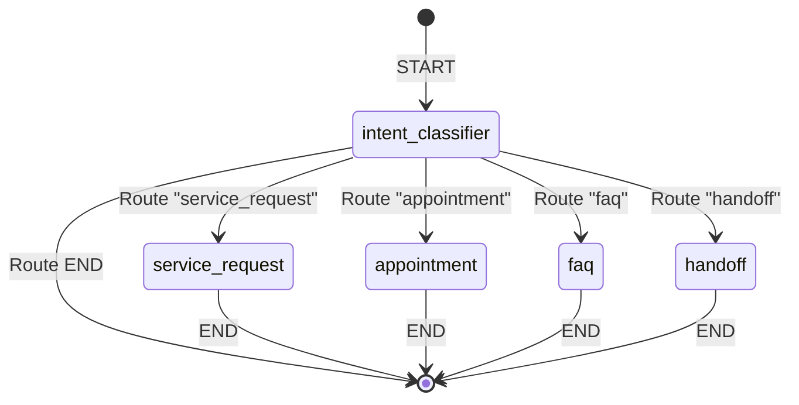

# Agent Orchestration Specification (VoiceAI)

This document details the Multi-Agent architecture orchestrated via **LangGraph**, which coordinates conversation flow, intent classification, sub-agent transitions, and function call delegation.

---

## 1. Graph State Schema

The conversation state is represented by a shared `State` object passed between nodes.

```python
from typing import TypedDict, Annotated, Sequence, Optional
from langchain_core.messages import BaseMessage
from langgraph.graph.message import add_messages

class CustomerInfo(TypedDict):
    id: Optional[int]
    name: Optional[str]
    phone: str
    email: Optional[str]
    vehicle_make: Optional[str]
    vehicle_model: Optional[str]
    vehicle_year: Optional[int]
    location: Optional[str]

class AgentState(TypedDict):
    # The message history of the call
    messages: Annotated[Sequence[BaseMessage], add_messages]
    
    # Customer record loaded from CRM
    customer: Optional[CustomerInfo]
    
    # Active IDs created during call
    service_request_id: Optional[int]
    appointment_id: Optional[int]
    
    # Router state
    current_agent: str  # "classifier" | "service_request" | "appointment" | "faq" | "handoff"
    
    # Flag to enable/disable DTMF input mode
    dtmf_active: bool
```

---

## 2. LangGraph State Machine (DAG)

The call flow is compiled as a conditional state machine where the entry point is the intent classifier, routing to the specialized agent nodes, which then transition directly to `END` on completion.



---

## 3. Node Definitions & Dynamic Config Routing

All graph nodes dynamically load their system instructions and parameters from the configuration JSON file (`config.json` managed via portal API).

### 3.1 Intent Classifier Node (`intent_classifier`)
Analyzes the caller's last statement and sets `current_agent` using structured LLM schemas.
* **System Prompt:** Loaded from `prompts.router` key in `config.json`.
* **Routing Logic (Conditional Edges):**
  * If `intent` is `new_customer_service_request` → Route to `service_request`.
  * If `intent` is `appointment_booking` / `appointment_reschedule` → Route to `appointment`.
  * If `intent` is `faq_business_knowledge` → Route to `faq`.
  * If `intent` is `human_handoff` → Route to `handoff`.
  * Else → Transition to `END` or loop on `intent_classifier` depending on query state.

### 3.2 Service Request Node (`service_request`)
Responsible for capturing caller information, vehicle metadata, and issue descriptions.
* **System Prompt:** Loaded from `prompts.service_request` key in `config.json`.
* **Dynamic Validation Behavior:** 
  - On invocation, the node scans the conversation history to check if the caller mentions any service name matching a catalog entry in the `services` database table.
  - The service name is resolved using a alphanumeric token Jaccard similarity matcher (`find_best_service_match`). If a match has a similarity score >= 0.25, the node retrieves that specific service's required flags (`req_customer_name`, `req_phone_number`, `req_vehicle_details`, `req_issue_description`, `req_location`) and its `duration_minutes`. These override the default system configurations.
  - If no service matches, it falls back to the default required fields configured in the portal configurations.
  - Required fields are gathered sequentially. If any required fields (e.g. customer name, vehicle details, or location) are missing, the node triggers the LLM to ask follow-up questions for the missing values.
* **Function Calls/DB Queries:**
  - Invokes `create_service_request(customer_id, vehicle_details, issue, service_type, time_slot)` where `vehicle_details` is a dictionary (`{"make": make, "model": model, "year": year}`) to register the auto ticket. The database layer automatically handles registering or matching the customer's vehicle details.

### 3.3 Appointment Booking Node (`appointment`)
Manages availability lookups and schedules calendar slots.
* **System Prompt:** Loaded from `prompts.appointment` key in `config.json`.
* **Exposed Tools (Bound to LLM):**
  - `check_availability_tool(preferred_date)`: Checks slot availability in one of two modes:
    1. **Mock-slot mode**: If `mock_calendar_slots` rows exist in the DB, it uses them as candidate slots, and queries the Google Calendar API concurrently (using a ThreadPoolExecutor) for all connected agents to filter out overlapping events.
    2. **Live/dynamic mode**: If mock slots are empty, it dynamically generates candidate business-hour slots for the next 14 business days (Mon-Fri, 9AM/11AM/2PM/4PM) and checks them against the real-time Google Calendar of each connected agent.
    - Returns up to 3 available datetime strings (YYYY-MM-DD HH:MM:SS).
  - `book_appointment_tool(appointment_datetime, phone, customer_name, make, model, year, service_type)`: Books an appointment and links it to the active service request. It resolves or inserts the vehicle metadata and assigns the slot in the database and agent's Google Calendar. It supports two modes:
    1. **Mock-slot mode**: Marks a slot in `mock_calendar_slots` as booked, and creates a Google Calendar event for the assigned agent.
    2. **Live/dynamic mode**: Picks any connected agent who is free, creates the Google Calendar event directly, and records the booking in `service_requests` (no mock slot row updated).
    - Automatically triggers a Gmail notification (SMTP or OAuth 2.0) with details.

### 3.4 FAQ Node (`faq`)
Performs RAG search to answer caller questions.
* **System Prompt:** Loaded from `prompts.faq` key in `config.json`.
* **RAG Flow:** Extracts user query, runs semantic search against local persistent ChromaDB collection, injects search context snippets into template, and generates response without hallucination.

### 3.5 Handoff Node (`handoff`)
Prepares telemetry and transfers call.
* **System Prompt:** Loaded from `prompts.handoff` key in `config.json`.
* **Flow:** Scans the active message stream for urgent keywords, compiles a 3-5 bullet point summary containing customer name, active service request ID, urgency level, and scheduled appointment status.
