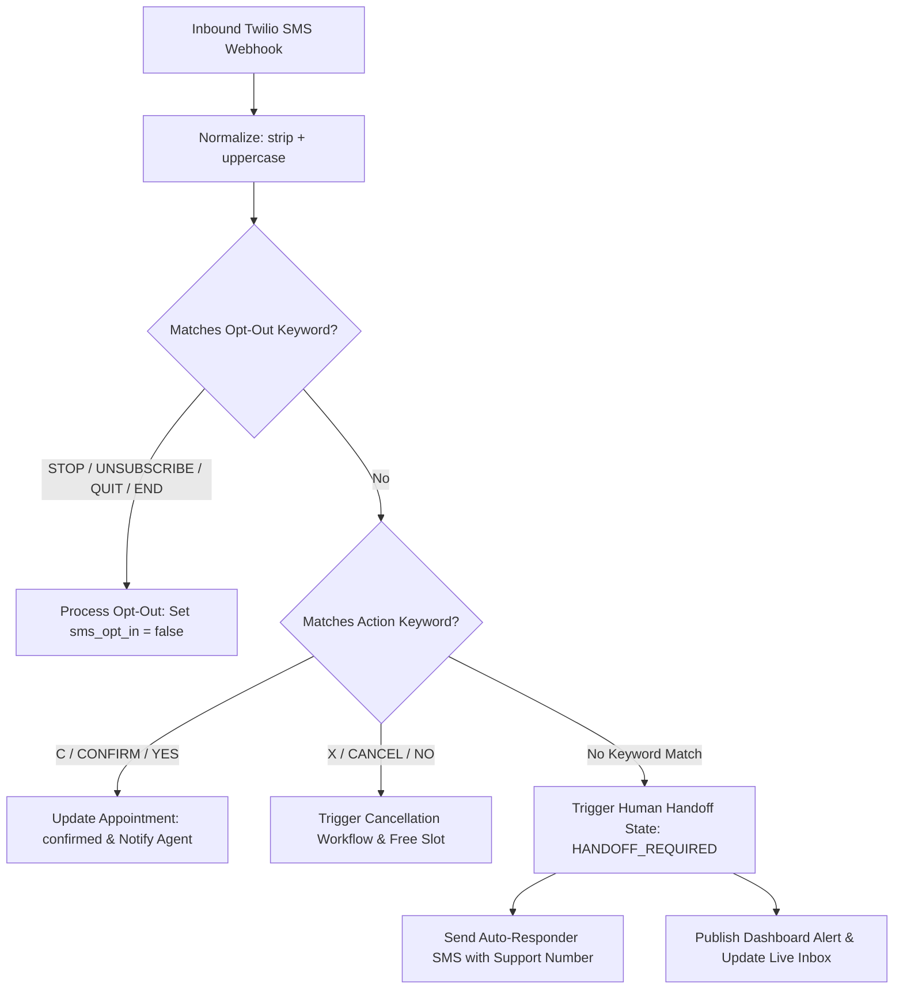

# Two-Way SMS & Human Handoff System Specification

## 1. Overview & Objectives

The Two-Way SMS & Human Handoff System handles inbound SMS messages received via Twilio. It categorizes incoming customer responses into **Automated Action Keywords** (e.g., confirmations, cancellations, opt-outs) vs. **Conversational Messages** requiring human intervention (human handoff).

When a conversational response is detected, the system transitions the thread to a human agent, updates the dashboard Inbox UI, and routes alerts to the appropriate support staff or service agent.

---

## 2. Inbound SMS Classification Engine

When Twilio dispatches an inbound HTTP Webhook for a customer reply, the system processes the message text through a classification pipeline.

**Pre-processing**: All inbound message text is normalized via `.strip().upper()` before classification. Only **exact single-token matches** trigger keyword handlers. Multi-word messages (e.g., `"Yes, but can we change the time?"`) are routed to the handoff path regardless of whether they contain a keyword substring.



---

## 3. Automated Keyword Handlers & Compliance

### 3.1 Regulatory Opt-Out / Opt-In Keywords (TCPA Compliance)
* **Opt-Out Keywords**: `STOP`, `UNSUBSCRIBE`, `QUIT`, `END`
  * Action: Update customer record `sms_opt_in = false`. Suppress future transactional SMS dispatches.
  * **Note**: `CANCEL` is intentionally **excluded** from the opt-out list to avoid conflict with the appointment cancellation keyword (see §3.2). Twilio natively handles `STOP` at the carrier level regardless.
* **Opt-In Keywords**: `START`, `UNSTOP`
  * Action: Update customer record `sms_opt_in = true`. Re-enable SMS dispatches.
* **Help Keyword**: `HELP`
  * Action: Respond with standard company support text and support phone number.

### 3.2 Appointment Action Keywords
* **Confirmation**: `C`, `CONFIRM`, `YES`
  * Action: Mark appointment status as `confirmed`. Send confirmation receipt to customer and notify assigned service agent.
* **Cancellation**: `X`, `CANCEL`, `NO`
  * Action: Mark appointment as `cancelled_by_customer`. Free up agent calendar slot and trigger cancellation notifications.

### 3.3 Multiple Appointment Disambiguation
When a customer sends an action keyword (`C`, `X`, etc.) and has **multiple active appointments**, the system resolves the target appointment as follows:
1. **Primary rule**: Target the appointment referenced by the **most recently sent outbound SMS** to this customer (stored as `last_sms_appointment_id` on the conversation record).
2. **Fallback**: If no recent SMS context exists, target the **next upcoming appointment** (chronologically by `booking_time`).
3. **No appointments**: If the customer has zero pending/in_progress appointments, reply with: *"We couldn't find an active appointment for your number. Please call {support_number} for help."* and route to `HANDOFF_REQUIRED`.

### 3.4 Keyword During Active Handoff
If a customer sends a keyword (e.g., `C`, `STOP`) while their thread is in `HANDOFF_REQUIRED` or `IN_PROGRESS` state:
* **Opt-out keywords** (`STOP`, `UNSUBSCRIBE`, `QUIT`, `END`) are **always** processed immediately regardless of handoff state.
* **Action keywords** (`C`, `CONFIRM`, `X`, `CANCEL`, etc.) are processed normally — the appointment is updated and the keyword action is appended to the handoff thread as context for the human agent.

### 3.5 Database Schema Requirements
The following schema changes are prerequisites for this feature:
* **`customers` table**: Add `sms_opt_in BOOLEAN DEFAULT TRUE` column.
* **`service_requests` table**: Expand status CHECK constraint to include `confirmed` and `cancelled_by_customer` in addition to existing values (`pending`, `in_progress`, `completed`, `cancelled`, `rescheduled`).

---

## 4. Handoff Lifecycle & State Machine

### 4.1 Thread Scoping
Conversation threads are scoped to the **customer phone number** (one thread per unique phone, not per appointment). The most recent or next upcoming appointment is displayed as context in the Inbox sidebar, but the thread itself persists across appointments.

The `sms_conversations` table stores:
* `customer_phone` (unique key)
* `state` (enum: `AUTOMATED`, `HANDOFF_REQUIRED`, `IN_PROGRESS`, `RESOLVED`)
* `last_auto_responder_at` (timestamp, for debounce)
* `context_appointment_id` (nullable FK, the most relevant appointment)
* `assigned_agent_id` (nullable FK, the agent currently handling the thread)

### 4.2 State Transitions

```text
[ AUTOMATED ] -------- (Free-Text Message Received) --------> [ HANDOFF_REQUIRED ]
      ^                                                              |
      |                                                              | (Agent Accepts / Replies)
      |                                                              v
[ RESOLVED / CLOSED ] <------- (Agent Closes Handoff) -------- [ IN_PROGRESS ]
```

1. **AUTOMATED**: System handles all outgoing/incoming automated templates.
2. **HANDOFF_REQUIRED**: Triggered when a customer sends a free-text message.
   * Auto-responder sent immediately to customer: *"Thank you! Our team has received your message. For urgent help, call {support_number}."*
   * Conversation added to the Dashboard Inbox under **"Needs Attention"**.
3. **IN_PROGRESS**: Active human conversation. An agent or admin has opened the thread and sent a reply via the Dashboard SMS Console. Automated reminders continue, but generic bot responses are suppressed.
4. **RESOLVED / CLOSED**: Human agent resolves the issue and resets the thread state back to `AUTOMATED`.

### 4.3 Auto-Responder Guards & Debounce
Before sending the auto-responder SMS on `HANDOFF_REQUIRED` transition:
1. **Opt-in check**: Verify `customer.sms_opt_in = true`. If opted out, skip the auto-responder entirely (still create the handoff thread and inbox alert).
2. **Debounce window**: If `last_auto_responder_at` is within the last **60 seconds**, suppress the duplicate auto-responder. Append the new message to the existing thread silently.
3. **Concurrent messages**: If a customer sends multiple free-text messages within 5 seconds, only one auto-responder is sent. All messages are appended chronologically to the same thread.

### 4.4 Agent Proactive Reply
If an agent sends a manual SMS via the Live Inbox to a customer whose thread is in `AUTOMATED` state (proactive outreach), the thread transitions to `IN_PROGRESS`. This prevents the customer's next reply from triggering an auto-responder while the human conversation is active.

---

## 5. Live Inbox Dashboard UI Specification

The Dashboard includes a **Conversational SMS Console** accessible by admins and assigned service agents:

### 5.1 Console Features
* **Thread List Column**: Split into **Needs Attention (Handoff Required)**, **In Progress**, and **All Messages**. Filterable by assigned service agent or appointment ID.
* **Main Chat View**: Displays full chronological conversation history (both automated templates sent by Twilio and inbound/outbound text messages).
* **Appointment Sidebar**: Displays customer contact info, active appointment details, status, and quick action buttons (*Reschedule*, *Cancel*, *Reassign Agent*).
* **Two-Way Reply Box**: Input field allowing human operators to type custom SMS messages dispatched via Twilio to the customer.

```text
+-----------------------------------------------------------------------------------------+
| Live SMS Inbox                                                                          |
+-----------------------------------+-----------------------------------------------------+
| Filter: [ Needs Attention (2)  ▼] | Customer: John Doe (+1 555-019-2831)                |
|                                   | Appointment: #APT-1082 (Today at 2:00 PM)           |
+-----------------------------------+-----------------------------------------------------+
| 🔴 John Doe           10:42 AM    | [System] 10:00 AM: Reminder sent for 2:00 PM.        |
| "I'll be 15 minutes late"          | [John Doe] 10:42 AM: "I'll be 15 minutes late"      |
|                                   | [Auto-Responder] 10:42 AM: "Message received..."    |
| 🟡 Alice Smith        Yesterday   |                                                     |
| "Can I change my address?"        |-----------------------------------------------------|
|                                   | Type message...                    [ Send SMS ]     |
+-----------------------------------+-----------------------------------------------------+
```

---

## 6. Support Number & Handoff Configuration

The system settings configuration includes dedicated options for handoff and support routing:

* **Support Phone Number**: Primary phone number included in automated fallback responses.
* **Auto-Responder Message Template**: Customizable text containing `{support_number}` variable.
* **Auto-Responder Debounce Window**: Configurable duration in seconds (Default: `60`).
* **Handoff Notification Alerts**: Toggles to send Email/Push alerts to assigned Service Agents or Admins when a customer enters `HANDOFF_REQUIRED` state.

---

## 7. Comprehensive Test Plan

### 7.1 Keyword & Compliance Classifier Tests

| Test ID | Test Category | Scenario / Inputs | Expected Output / Behavior |
| :--- | :--- | :--- | :--- |
| **UT-HO-01** | Confirmation Keyword | Customer texts `"C"` or `"CONFIRM"` | Appointment status updated to `confirmed`. Agent notified. Auto-reply receipt sent. |
| **UT-HO-02** | Cancellation Keyword | Customer texts `"CANCEL"` or `"X"` | Appointment status updated to `cancelled_by_customer`. Slot freed. Notifications sent. |
| **UT-HO-03** | Opt-Out Keyword | Customer texts `"STOP"` | Customer `sms_opt_in` set to `false`. System sends zero further automated SMS. |
| **UT-HO-04** | Opt-In Keyword | Customer texts `"START"` | Customer `sms_opt_in` set to `true`. Transactional SMS dispatches re-enabled. |
| **UT-HO-05** | Help Keyword | Customer texts `"HELP"` | System replies with configured company support contact details. |
| **UT-HO-06** | CANCEL Not Opt-Out | Customer texts `"CANCEL"` | System cancels appointment (not opt-out). Customer `sms_opt_in` remains `true`. |
| **UT-HO-07** | Text Normalization | Customer texts `"  confirm  "` (with whitespace) | Normalized to `CONFIRM`. Appointment confirmed. |
| **UT-HO-08** | Multi-Word Not Keyword | Customer texts `"Yes, but can we change the time?"` | Treated as free-text (not `YES` keyword). Triggers `HANDOFF_REQUIRED`. |

### 7.2 Multiple Appointment Disambiguation Tests

| Test ID | Test Category | Scenario / Inputs | Expected Output / Behavior |
| :--- | :--- | :--- | :--- |
| **UT-HO-09** | Single Appointment | Customer with 1 pending appointment texts `"C"` | That appointment is confirmed. |
| **UT-HO-10** | Multiple Appointments | Customer with 2 pending appointments texts `"X"`. Last SMS was about Appointment #2. | Appointment #2 is cancelled (most recent SMS context). |
| **UT-HO-11** | No Appointments | Customer with 0 appointments texts `"C"` | Error reply sent. Thread routed to `HANDOFF_REQUIRED`. |

### 7.3 State Machine & Handoff Tests

| Test ID | Test Category | Scenario / Inputs | Expected Output / Behavior |
| :--- | :--- | :--- | :--- |
| **UT-HO-12** | State Transition | Customer texts free-text: `"I am stuck in traffic"` | Conversation state moves from `AUTOMATED` to `HANDOFF_REQUIRED`. |
| **UT-HO-13** | Auto-Responder | Customer triggers `HANDOFF_REQUIRED` | Auto-responder SMS dispatched immediately containing configured support phone number. |
| **UT-HO-14** | Inbox Alert | Customer triggers `HANDOFF_REQUIRED` | Thread appears in Live Inbox under **"Needs Attention"** tab with unread badge. |
| **UT-HO-15** | Human Agent Reply | Operator types reply in Live Inbox UI and hits Send | Outbound Twilio SMS sent to customer. Thread state moves to `IN_PROGRESS`. |
| **UT-HO-16** | Thread Resolution | Operator clicks "Mark Resolved" | Thread state resets to `AUTOMATED`. |
| **UT-HO-17** | Agent Proactive Reply | Agent sends SMS to customer in `AUTOMATED` state via Inbox | Thread transitions to `IN_PROGRESS`. Next customer reply does NOT trigger auto-responder. |

### 7.4 Edge Cases & Reliability Tests

1. **Opted-Out Customer Attempt**:
   * If customer previously texted `STOP` and system attempts sending a 24h reminder, the dispatch engine must check `sms_opt_in` and skip sending without calling Twilio.
2. **Opted-Out Customer Auto-Responder Guard**:
   * If an opted-out customer sends a free-text message, the system creates the handoff thread and inbox alert but does **not** send the auto-responder SMS.
3. **Concurrent Inbound Messages (Debounce)**:
   * If customer sends two free-text messages within 5 seconds, system sends only **one** auto-responder message and appends both texts to the open handoff thread. The debounce check uses `last_auto_responder_at` with a 60-second window.
4. **Twilio Webhook Security**:
   * Verify system validates Twilio Request Signatures (`X-Twilio-Signature`) on the inbound webhook to prevent forged incoming SMS injections.
5. **Keyword During Handoff**:
   * Customer sends `"STOP"` while thread is `IN_PROGRESS`. System processes opt-out immediately and logs the action in the thread for the human agent.
6. **Opt-Out Dispatch Guard**:
   * Every outbound SMS dispatch (including auto-responder, human replies forwarded via Twilio) must check `customer.sms_opt_in` before calling the Twilio API.
