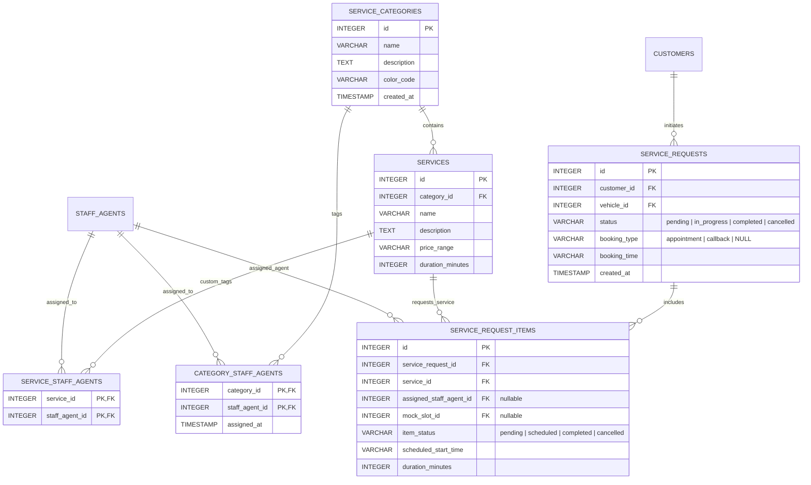
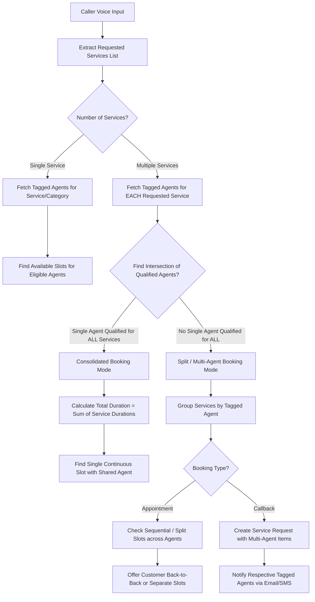

# Service Category Agent Tagging & Multi-Agent Routing Specification

This specification defines the architecture, database schema, portal UI controls, REST API endpoints, and AI voice agent orchestration rules for tagging Service Categories to specific Staff Agents and handling multi-service appointments and callbacks requiring multiple agents.

---

## 1. Executive Summary & Goals

### 1.1 Business Context
In automotive service centers and technical service businesses, different staff members specialize in distinct types of work (e.g., Master Mechanics for complex drivetrain issues, Electrical Techs for battery/EV diagnosis, Quick Lube Techs for oil and tire changes). 

Currently, services in the catalog are unassigned, and service requests/appointments reference a single staff agent. This specification introduces:
1. **Catalog Category Tagging**: Ability for portal users to organize services into **Service Categories** and tag **multiple Staff Agents** to each category (or individual service).
2. **Multi-Agent Intake & Dispatch**: Intelligent voice call orchestration that detects when a customer requests multiple services and handles routing/scheduling whether a single qualified agent can perform all services or different agents must be assigned for separate/sequential slots or callbacks.

### 1.2 Core Objectives
- **Portal Configuration**: Provide an intuitive, glassmorphic UI in the Catalog Manager to create categories and assign/tag qualified staff agents to each.
- **Dynamic Qualification Lookup**: During voice call intake, resolve which agents are eligible for each requested service based on category and service-level tags.
- **Consolidated vs. Split Scheduling**:
  - **Single Qualified Agent**: If one staff member is qualified for all requested services, schedule a consolidated appointment slot.
  - **Multi-Agent Assignment**: If requested services require different specialists, seamlessly schedule sequential or split slots with different staff agents (or generate multi-agent callback notifications).

---

## 2. Entity Relationship & Data Architecture



### 2.1 Database Schema Additions (SQL DDL)

```sql
-- 1. Service Categories Table
CREATE TABLE IF NOT EXISTS service_categories (
    id INTEGER PRIMARY KEY AUTOINCREMENT,
    name VARCHAR(100) NOT NULL UNIQUE,
    description TEXT DEFAULT NULL,
    color_code VARCHAR(20) DEFAULT '#3B82F6', -- Hex color code for UI pills
    created_at TIMESTAMP DEFAULT CURRENT_TIMESTAMP
);

-- 2. Category to Staff Agent Junction Table (Many-to-Many Tagging)
CREATE TABLE IF NOT EXISTS category_staff_agents (
    category_id INTEGER NOT NULL,
    staff_agent_id INTEGER NOT NULL,
    assigned_at TIMESTAMP DEFAULT CURRENT_TIMESTAMP,
    PRIMARY KEY (category_id, staff_agent_id),
    FOREIGN KEY (category_id) REFERENCES service_categories(id) ON DELETE CASCADE,
    FOREIGN KEY (staff_agent_id) REFERENCES staff_agents(id) ON DELETE CASCADE
);

-- 3. Optional Service-Level Staff Agent Override Junction Table
CREATE TABLE IF NOT EXISTS service_staff_agents (
    service_id INTEGER NOT NULL,
    staff_agent_id INTEGER NOT NULL,
    PRIMARY KEY (service_id, staff_agent_id),
    FOREIGN KEY (service_id) REFERENCES services(id) ON DELETE CASCADE,
    FOREIGN KEY (staff_agent_id) REFERENCES staff_agents(id) ON DELETE CASCADE
);

-- 4. Add category_id FK to Services Table
ALTER TABLE services ADD COLUMN category_id INTEGER DEFAULT NULL REFERENCES service_categories(id) ON DELETE SET NULL;

-- 5. Service Request Line Items Table (Supports Multi-Service / Multi-Agent Intake)
CREATE TABLE IF NOT EXISTS service_request_items (
    id INTEGER PRIMARY KEY AUTOINCREMENT,
    service_request_id INTEGER NOT NULL,
    service_id INTEGER NOT NULL,
    assigned_staff_agent_id INTEGER DEFAULT NULL,
    mock_slot_id INTEGER DEFAULT NULL,
    item_status VARCHAR(50) NOT NULL DEFAULT 'pending' CHECK (item_status IN ('pending', 'scheduled', 'completed', 'cancelled')),
    scheduled_start_time VARCHAR(100) DEFAULT NULL,
    duration_minutes INTEGER DEFAULT 30,
    created_at TIMESTAMP DEFAULT CURRENT_TIMESTAMP,
    FOREIGN KEY (service_request_id) REFERENCES service_requests(id) ON DELETE CASCADE,
    FOREIGN KEY (service_id) REFERENCES services(id) ON DELETE RESTRICT,
    FOREIGN KEY (assigned_staff_agent_id) REFERENCES staff_agents(id) ON DELETE SET NULL,
    FOREIGN KEY (mock_slot_id) REFERENCES mock_calendar_slots(id) ON DELETE SET NULL
);

-- Indexes for efficient querying
CREATE INDEX IF NOT EXISTS idx_services_category ON services(category_id);
CREATE INDEX IF NOT EXISTS idx_category_staff ON category_staff_agents(category_id);
CREATE INDEX IF NOT EXISTS idx_sr_items_request ON service_request_items(service_request_id);
CREATE INDEX IF NOT EXISTS idx_sr_items_agent ON service_request_items(assigned_staff_agent_id);
```

---

## 3. Portal Frontend UI Specification (Catalog Manager)

The Catalog Manager (`/portal` Service Manager View) is upgraded to provide Category management and Agent tagging controls.

### 3.1 UI Design & Layout

```
┌─────────────────────────────────────────────────────────────────────────────┐
│ CATALOG & SERVICE MANAGER                                                    │
├─────────────────────────────────────────────────────────────────────────────┤
│  [ + Add New Category ]   [ + Add New Service ]                             │
│                                                                             │
│ ┌─────────────────────────────────────────────────────────────────────────┐ │
│ │ CATEGORIES & AGENT ASSIGNMENT                                           │ │
│ ├─────────────────────────────────────────────────────────────────────────┤ │
│ │ 🏷️ Brakes & Suspension (#EF4444)                                        │ │
│ │    Services: Brake Inspection, Rotor Replacement, Brake Pad Change      │ │
│ │    Tagged Agents: [John Doe (Master Mechanic) ×] [Bob Vance (Tech) ×]   │ │
│ │    [ + Tag Agent ▾ ]                                                    │ │
│ ├─────────────────────────────────────────────────────────────────────────┤ │
│ │ 🏷️ Engine & Transmission (#F59E0B)                                      │ │
│ │    Services: Transmission Flush, Engine Diagnostics                      │ │
│ │    Tagged Agents: [John Doe (Master Mechanic) ×]                        │ │
│ │    [ + Tag Agent ▾ ]                                                    │ │
│ └─────────────────────────────────────────────────────────────────────────┘ │
│                                                                             │
│ ┌─────────────────────────────────────────────────────────────────────────┐ │
│ │ SERVICES CATALOG LIST                                                   │ │
│ ├──────────────────────────────────────┬─────────────┬────────────────────┤ │
│ │ Service Name                         │ Category    │ Tagged Agents      │ │
│ ├──────────────────────────────────────┼─────────────┼────────────────────┤ │
│ │ Brake Pad Replacement ($150-$250)    │ Brakes      │ John Doe, Bob V.   │ │
│ │ Transmission Service ($200-$400)      │ Transmission│ John Doe           │ │
│ │ AC Recharge & Inspection ($99)       │ HVAC        │ Jane Smith         │ │
│ └──────────────────────────────────────┴─────────────┴────────────────────┘ │
└─────────────────────────────────────────────────────────────────────────────┘
```

### 3.2 Key UI Components & Interactions

1. **Category Pill & Agent Tagging Selector**:
   - Each Category displays visual tags for all currently assigned Staff Agents.
   - Tag badges feature an "×" icon to immediately unassign an agent.
   - A dropdown button `[ + Tag Agent ▾ ]` opens an agent multi-select menu showing all active staff members with their role (e.g. `Jane Smith (Senior Tech)`).
   - Selecting an agent sends an asynchronous `POST /api/v1/portal/categories/{id}/agents` call and updates the UI without page reload.

2. **Add / Edit Category Modal**:
   - Fields: Category Name, Description, Color Picker (for visual badge highlight), and initial Staff Agent multi-select checkboxes.

3. **Service Form Category Mapping**:
   - When creating or editing a Service, a dropdown allows assigning it to a Category.
   - Below the category dropdown, an option toggles between:
     - `[x] Inherit Category Agent Tags (Recommended)`
     - `[ ] Override with Specific Service Agents`

---

## 4. Multi-Agent Voice Intake & Scheduling Architecture

When a caller requests service(s) during an automated voice session, the LangGraph `service_request` and `appointment` nodes execute the multi-agent qualification and slot matching algorithm.



### 4.1 Agent Qualification Resolution Logic

For any requested service $S_i$:
$$\text{QualifiedAgents}(S_i) = \begin{cases} 
\text{TaggedAgents}(S_i) & \text{if custom service-level tags exist} \\
\text{TaggedAgents}(\text{Category}(S_i)) & \text{if category tags exist} \\
\text{AllActiveStaffAgents()} & \text{if untagged (fallback)}
\end{cases}$$

### 4.2 Single vs. Multi-Agent Dispatch Algorithm

Given a list of requested services $[S_1, S_2, \dots, S_n]$:

#### Step 1: Check Universal Single Agent Capability
Find candidate agents who are qualified to perform **all** requested services:
$$\text{UniversalAgents} = \bigcap_{i=1}^n \text{QualifiedAgents}(S_i)$$

- **If $\text{UniversalAgents} \neq \emptyset$**:
  - Calculate total required appointment duration: $D_{total} = \sum_{i=1}^n \text{duration}(S_i)$.
  - Search for calendar slot where any $A \in \text{UniversalAgents}$ has continuous free time of duration $D_{total}$.
  - If a slot is found, book a single consolidated appointment assigned to Agent $A$.

#### Step 2: Multi-Agent Split Assignment
- **If $\text{UniversalAgents} = \emptyset$ OR no single agent has a continuous slot**:
  - Partition the services among qualified agents:
    - Service $S_1 \rightarrow$ Agent $A_1 \in \text{QualifiedAgents}(S_1)$
    - Service $S_2 \rightarrow$ Agent $A_2 \in \text{QualifiedAgents}(S_2)$
  - **Appointment Booking Flow**:
    - Query candidate slots for Agent $A_1$ (for $S_1$) and Agent $A_2$ (for $S_2$).
    - Prefer **sequential back-to-back slots** (e.g. Agent $A_1$ at 10:00 AM, Agent $A_2$ at 11:00 AM on the same day).
    - Present the proposed schedule to caller: 
      *"I have scheduled your Brake Inspection with John at 10:00 AM, followed by your Transmission Flush with Jane at 11:00 AM. Does that work for you?"*
    - Record parent `service_requests` entry and sub-items in `service_request_items` with their respective `assigned_staff_agent_id` and `mock_slot_id`.
  - **Callback Request Flow**:
    - Record parent `service_requests` entry with `booking_type = 'callback'`.
    - Create `service_request_items` records assigning $S_1$ to Agent $A_1$ and $S_2$ to Agent $A_2$.
    - Send SMS / Email notifications to both Agent $A_1$ and Agent $A_2$ detailing their respective assigned items.

---

## 5. REST API Specifications

### 5.1 List Categories & Tagged Agents
- **Endpoint**: `GET /api/v1/portal/categories`
- **Response Payload**:
```json
{
  "status": "success",
  "categories": [
    {
      "id": 1,
      "name": "Brakes & Suspension",
      "description": "Brake system inspections, pad/rotor replacements, and suspension work.",
      "color_code": "#EF4444",
      "created_at": "2026-07-29T18:00:00Z",
      "services_count": 3,
      "tagged_agents": [
        {"id": 1, "name": "John Doe", "role": "Master Mechanic", "email": "john@example.com"},
        {"id": 3, "name": "Bob Vance", "role": "Technician", "email": "bob@example.com"}
      ]
    }
  ]
}
```

### 5.2 Create Service Category
- **Endpoint**: `POST /api/v1/portal/categories`
- **Request Body**:
```json
{
  "name": "Electrical & Hybrid",
  "description": "EV battery diagnostics, wiring, and high-voltage repairs.",
  "color_code": "#10B981",
  "agent_ids": [2]
}
```

### 5.3 Tag Agents to Category
- **Endpoint**: `POST /api/v1/portal/categories/{id}/agents`
- **Request Body**:
```json
{
  "agent_ids": [1, 2, 3]
}
```
- **Response Payload**:
```json
{
  "status": "success",
  "message": "Staff agents tagged to category successfully",
  "category_id": 1,
  "tagged_agent_ids": [1, 2, 3]
}
```

### 5.4 Untag Agent from Category
- **Endpoint**: `DELETE /api/v1/portal/categories/{id}/agents/{agent_id}`
- **Response Payload**:
```json
{
  "status": "success",
  "message": "Staff agent removed from category"
}
```

### 5.5 Multi-Service Availability Search
- **Endpoint**: `POST /api/v1/portal/appointments/available-multi`
- **Request Body**:
```json
{
  "service_ids": [1, 4],
  "preferred_date": "2026-08-01"
}
```
- **Response Payload**:
```json
{
  "status": "success",
  "is_single_agent_capable": false,
  "options": [
    {
      "type": "sequential",
      "total_duration_minutes": 90,
      "schedule": [
        {
          "service_id": 1,
          "service_name": "Brake Inspection",
          "assigned_agent": {"id": 1, "name": "John Doe"},
          "start_time": "2026-08-01 10:00:00",
          "end_time": "2026-08-01 10:30:00"
        },
        {
          "service_id": 4,
          "service_name": "EV Battery Health Check",
          "assigned_agent": {"id": 2, "name": "Jane Smith"},
          "start_time": "2026-08-01 10:30:00",
          "end_time": "2026-08-01 11:30:00"
        }
      ]
    }
  ]
}
```

---

## 6. Edge Cases & Conflict Handling

| Edge Case / Scenario | System Behavior & Mitigation |
| :--- | :--- |
| **Untagged Category / Service** | If no staff agents are tagged to a category or service, the system falls back to considering **all active staff agents** as eligible. A warning badge *"No agents tagged - using all staff"* is displayed in the portal. |
| **No Common Agent & No Back-to-Back Slots** | If Agent A ($S_1$) is available at 10 AM and Agent B ($S_2$) is only available at 3 PM on the requested day, the AI voice agent offers the split times or suggests an alternate date with consecutive availability. |
| **Agent Schedule Conflict / Overlap** | Google Calendar sync concurrent check verifies free/busy status across all candidate agents before offering slots, preventing double booking. |
| **Multi-Item Reschedule / Cancellation** | Cancelling a multi-service appointment updates individual `service_request_items` status to `cancelled` and frees the associated `mock_calendar_slots` and Google Calendar events for the respective assigned agents. |
| **Deleted Staff Agent** | Cascading foreign keys (`ON DELETE CASCADE`) remove the agent from `category_staff_agents`. Existing scheduled `service_request_items` retain historical records with `assigned_staff_agent_id` set to `NULL`. |

---

## 7. Verification & Testing Plan

### 7.1 Automated Unit & Integration Tests
- **DB Migration Tests**: Verify foreign keys, junction table constraint enforcement, and cascading deletes.
- **Category API Tests**: Test CRUD operations for categories and tag/untag endpoint validations.
- **Qualification Matcher Tests**: Verify `UniversalAgents` calculation for single vs. multi-service combinations.
- **Multi-Slot Booking Engine Tests**: Validate sequential vs. split appointment slot selection logic using mock calendar data.

### 7.2 Manual Portal & Voice Verification
1. **Portal UI Validation**:
   - Create Category "Transmission & Drivetrain", tag Agent John Doe.
   - Create Category "HVAC Systems", tag Agent Jane Smith.
   - Verify visually styled pills and instant tag toggle in the catalog manager view.
2. **Voice Intake Test**:
   - Simulate a caller requesting: *"I need a transmission flush and an AC recharge."*
   - Verify AI agent identifies both services, determines John and Jane are required, and books sequential slots or creates callback items assigned to both staff members.
