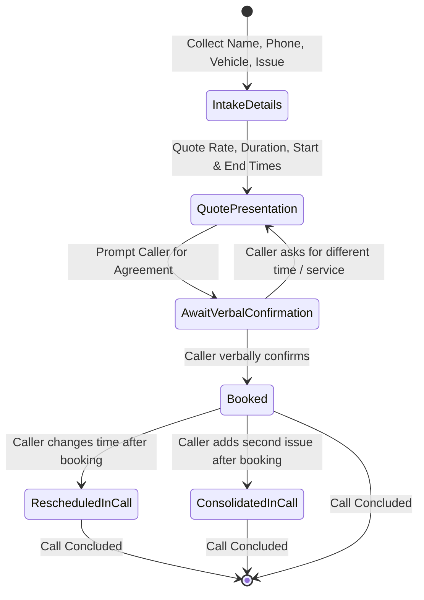
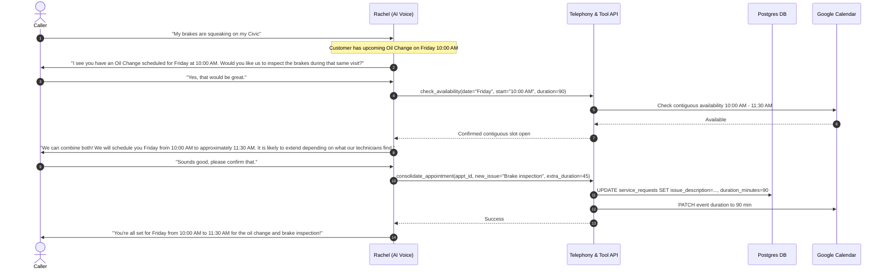

# Data Model: Booking Confirmation Guard & Customer Appointment History Context

**Feature**: `001-booking-confirmation-history`
**Date**: 2026-09-29

## Entities & Schemas

### 1. Customer
Represents the caller profile identified primarily by 10-digit phone number.

| Field | Type | Description |
|---|---|---|
| `id` | Integer (PK) | Unique customer ID |
| `name` | String | Customer full name |
| `phone` | String (Unique index) | 10-digit normalized phone number (E.164 or digits) |
| `created_at` | Timestamp | Record creation timestamp |
| `updated_at` | Timestamp | Record last update timestamp |

### 2. Vehicle
Represents a vehicle registered to a customer.

| Field | Type | Description |
|---|---|---|
| `id` | Integer (PK) | Unique vehicle ID |
| `customer_id` | Integer (FK) | Reference to `customers.id` |
| `make` | String | Vehicle make (e.g., Honda, Toyota) |
| `model` | String | Vehicle model (e.g., Civic, Camry) |
| `year` | Integer | Model year (e.g., 2021) |
| `created_at` | Timestamp | Record creation timestamp |

### 3. Service Request / Appointment (`service_requests`)
Represents an appointment booking or callback intake.

| Field | Type | Description |
|---|---|---|
| `id` | Integer (PK) | Unique service request ID |
| `customer_id` | Integer (FK) | Reference to `customers.id` |
| `vehicle_id` | Integer (FK, nullable) | Reference to `vehicles.id` |
| `service_type` | String | Primary service category or multi-service name |
| `issue_description` | Text | Detailed symptom description or consolidated issues list |
| `booking_type` | String | `appointment`, `callback`, or `appointment_and_callback` |
| `booking_time` | Timestamp | Scheduled start time of the appointment or preferred callback |
| `duration_minutes` | Integer | Total expected duration (default 60; dynamically calculated) |
| `status` | String | `pending`, `confirmed`, `in_progress`, `completed`, `cancelled` |
| `calendar_event_id` | String (nullable) | External Google Calendar event ID |
| `call_sid` | String (nullable) | Twilio Call SID or ElevenLabs conversation ID for session tracing |
| `created_at` | Timestamp | Record creation timestamp |
| `updated_at` | Timestamp | Record last update timestamp |

### 4. Call Session Booking Context (Transient / Memory Cache / Session Guard)
Maintains in-flight booking state during an active call session to enable atomic updates and deduplication.

| Field | Type | Description |
|---|---|---|
| `session_key` | String | Unique identifier: `call_sid` or `caller_phone:date` |
| `service_request_id` | Integer | ID of the service request created during this call |
| `booking_time` | Timestamp | Currently booked start datetime |
| `duration_minutes` | Integer | Currently booked duration |
| `created_at` | Timestamp | When the booking was placed in this session |

---

## State Transitions & Workflows

### A. New Appointment Booking Lifecycle

### B. Consolidating an Issue into an Existing Appointment

---

## Validation & Business Rules

1. **Explicit Confirmation Gate**: `create_service_request` with `booking_type='appointment'` must only be dispatched after explicit confirmation.
2. **Session In-Flight Deduplication**: If `create_service_request` or `book_appointment` is received for a `phone` / `customer_id` that already created an appointment within the last 15 minutes or with the same `call_sid`, the system MUST update that existing appointment rather than inserting a duplicate record.
3. **Disclosure Rule**: Whenever an appointment time is stated or confirmed, the assistant MUST state both the start time and expected end time/duration, and include the disclosure that the visit is likely to extend depending on service and diagnostic findings.
4. **Contiguous Capacity Rule**: When combining issues, if `original_time + new_duration` extends beyond available technician capacity or business hours, the system MUST refuse silent truncation and prompt the user to either choose a larger open slot or book a separate visit.
