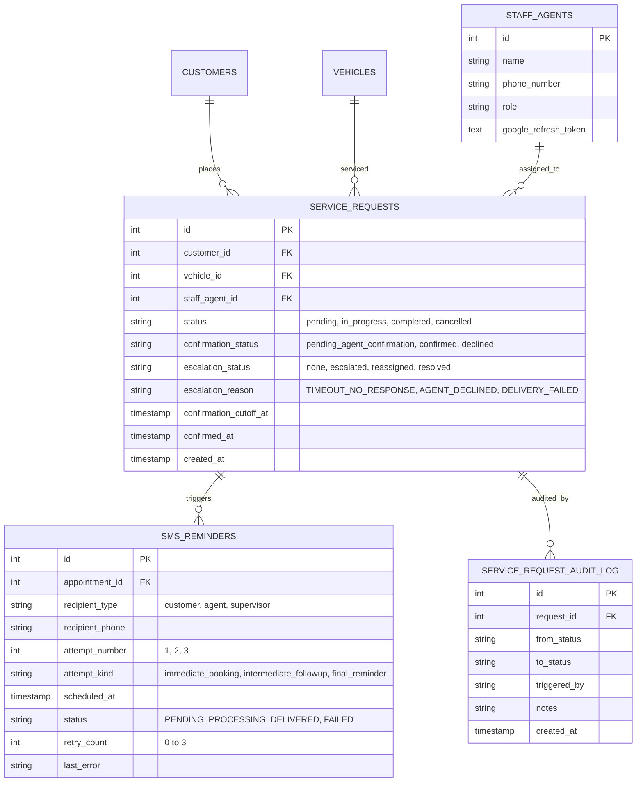
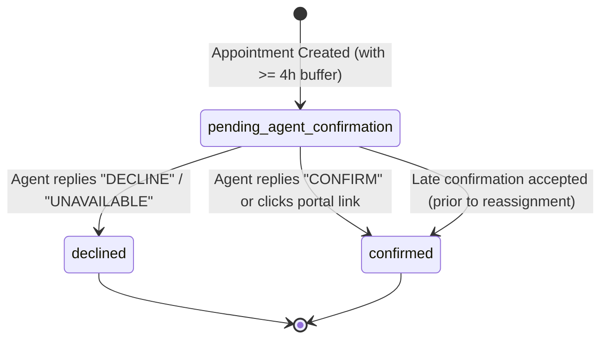
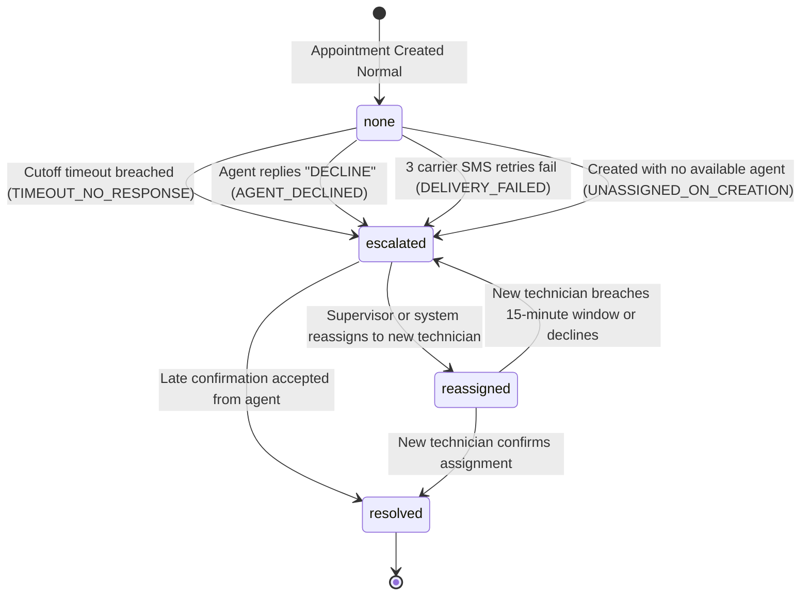

# Phase 1 Data Model: Schema Additions, State Machines & Validation Rules

**Feature**: [002-appointment-reminder-escalation](file:///Users/rohanroy/Coding/voiceService/specs/002-appointment-reminder-escalation/spec.md)  
**Date**: 2026-09-30  
**Status**: Completed  

---

## 1. Database Schema Additions & Modifications

### 1.1 `service_requests` Table Extensions

Extend the existing `service_requests` table to track agent confirmation, calculated cutoff timestamps, and supervisor escalation states:

```sql
-- Migration: Add confirmation and escalation tracking columns
ALTER TABLE service_requests 
ADD COLUMN IF NOT EXISTS confirmation_status VARCHAR(40) DEFAULT 'pending_agent_confirmation' 
    CHECK (confirmation_status IN ('pending_agent_confirmation', 'confirmed', 'declined')),
ADD COLUMN IF NOT EXISTS escalation_status VARCHAR(40) DEFAULT 'none' 
    CHECK (escalation_status IN ('none', 'escalated', 'reassigned', 'resolved')),
ADD COLUMN IF NOT EXISTS escalation_reason VARCHAR(50) DEFAULT NULL 
    CHECK (escalation_reason IN (NULL, 'TIMEOUT_NO_RESPONSE', 'AGENT_DECLINED', 'DELIVERY_FAILED', 'UNASSIGNED_ON_CREATION', 'MANUAL_SUPERVISOR_ACTION')),
ADD COLUMN IF NOT EXISTS confirmation_cutoff_at TIMESTAMP DEFAULT NULL,
ADD COLUMN IF NOT EXISTS confirmed_at TIMESTAMP DEFAULT NULL;

-- Efficient query indexes for background polling and portal filtering
CREATE INDEX IF NOT EXISTS idx_sr_confirmation_cutoff 
    ON service_requests(confirmation_status, confirmation_cutoff_at) 
    WHERE confirmation_status = 'pending_agent_confirmation';

CREATE INDEX IF NOT EXISTS idx_sr_escalation_status 
    ON service_requests(escalation_status) 
    WHERE escalation_status != 'none';
```

### 1.2 `sms_reminders` Table Extensions

Enhance the `sms_reminders` table to record attempt sequencing, attempt classification, and delivery retry counts:

```sql
ALTER TABLE sms_reminders 
ADD COLUMN IF NOT EXISTS attempt_number INTEGER DEFAULT 1,
ADD COLUMN IF NOT EXISTS attempt_kind VARCHAR(50) DEFAULT 'final_reminder' 
    CHECK (attempt_kind IN ('immediate_booking', 'intermediate_followup', 'final_reminder', 'pre_visit_courtesy', 'supervisor_alert', 'reassignment_prompt')),
ADD COLUMN IF NOT EXISTS retry_count INTEGER DEFAULT 0,
ADD COLUMN IF NOT EXISTS last_error TEXT DEFAULT NULL;

-- Composite index for the polling worker:
CREATE INDEX IF NOT EXISTS idx_sms_reminders_polling 
    ON sms_reminders(status, scheduled_at) 
    WHERE status = 'PENDING';
```

### 1.3 `staff_agents` Indexing

Ensure instant telephone number lookup for incoming agent SMS replies:

```sql
CREATE INDEX IF NOT EXISTS idx_staff_agents_phone 
    ON staff_agents(phone_number);
```

---

## 2. Entity Relationship Diagram



---

## 3. State Machines & Lifecycle Transitions

### 3.1 Confirmation State Transitions



### 3.2 Escalation State Transitions



---

## 4. Configuration Schema (`config.json` & Portal Settings)

The following parameters must be exposed in `config.json` and editable via `GET /api/v1/portal/config` and `POST /api/v1/portal/config`:

```json
{
  "min_booking_buffer_hours": 4,
  "initial_notification_enabled": true,
  "sla_advance_booking_hours": 4,
  "sla_medium_booking_hours": 3,
  "sla_short_booking_hours": 1.5,
  "final_reminder_hours": 2,
  "overnight_grace_minutes": 30,
  "max_dispatch_retries": 3,
  "retry_backoff_minutes": [1, 5, 15],
  "business_hours_start": 8,
  "business_hours_end": 18,
  "business_days": [0, 1, 2, 3, 4],
  "supervisor_alert_phone": "+19195550199",
  "auto_reassign_on_escalation": false,
  "reassignment_confirmation_window_minutes": 15
}
```

---

## 5. Validation Rules & Integrity Constraints

1. **Lead Time Constraint**:
   $$T_{\text{appt}} \ge T_{\text{current}} + \text{min\_booking\_buffer\_hours} \times 3600\text{ seconds}$$
   If an appointment slot fails this check, `validate_appointment_lead_time` raises `BookingHorizonError(min_buffer=4)`.

2. **Operating Hours Constraint**:
   $$T_{\text{appt}} \in \text{business\_hours} \quad \text{and} \quad \text{weekday}(T_{\text{appt}}) \in \text{business\_days}$$

3. **Confirmation Cutoff Calculation**:
   $$T_{\text{cutoff}} = \min\Big( T_{\text{booked}} \oplus_{\text{BH}} \text{AcceptanceSLA}(H_{\text{lead}}), \quad T_{\text{appt}} - \text{final\_reminder\_hours} \Big)$$
   where:
   - $H_{\text{lead}} \ge 24\text{h} \implies \text{AcceptanceSLA} = 4\text{ Business Hours}$
   - $6\text{h} \le H_{\text{lead}} < 24\text{h} \implies \text{AcceptanceSLA} = 3\text{ Business Hours}$
   - $4\text{h} \le H_{\text{lead}} < 6\text{h} \implies \text{AcceptanceSLA} = 1.5\text{ Business Hours}$
   - If $T_{\text{cutoff}} < \text{Opening} + \text{overnight\_grace\_minutes}$, apply Morning Grace: $T_{\text{cutoff}} = \text{Opening} + \text{overnight\_grace\_minutes}$.

4. **Row-Level Lock Integrity**:
   State transitions on `sms_reminders` and `service_requests` MUST use `SELECT ... FOR UPDATE` (or `FOR UPDATE SKIP LOCKED` in polling cycles) to prevent dual-processing or race conditions between incoming webhooks and the background escalation runner.
