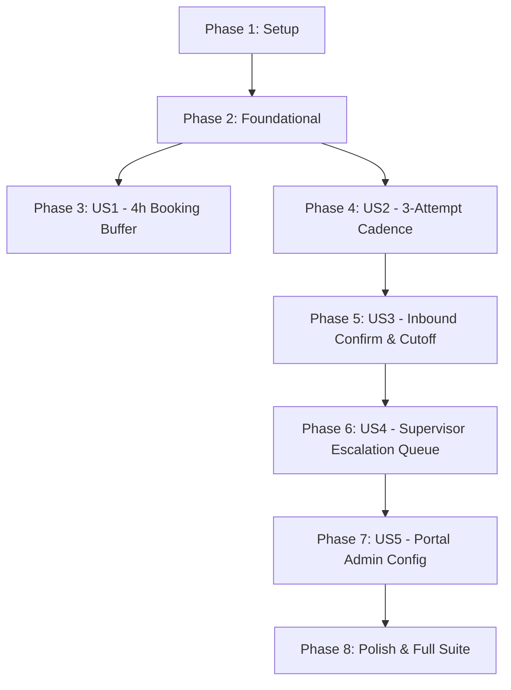

# Tasks: Appointment Reminders, Dual Confirmation, Business-Hours Escalation & 4-Hour Booking Buffer

**Input**: Design documents from `/specs/002-appointment-reminder-escalation/`  
**Prerequisites**: [plan.md](file:///Users/rohanroy/Coding/voiceService/specs/002-appointment-reminder-escalation/plan.md), [spec.md](file:///Users/rohanroy/Coding/voiceService/specs/002-appointment-reminder-escalation/spec.md), [research.md](file:///Users/rohanroy/Coding/voiceService/specs/002-appointment-reminder-escalation/research.md), [data-model.md](file:///Users/rohanroy/Coding/voiceService/specs/002-appointment-reminder-escalation/data-model.md), [contracts/](file:///Users/rohanroy/Coding/voiceService/specs/002-appointment-reminder-escalation/contracts/), [quickstart.md](file:///Users/rohanroy/Coding/voiceService/specs/002-appointment-reminder-escalation/quickstart.md)  

**Tests**: Test-driven development (TDD) required per project constitution; test tasks are included and must be written and executed first.

**Organization**: Tasks are grouped by user story to enable independent implementation and testing of each story.

## Format: `[ID] [P?] [Story] Description`

- **[P]**: Can run in parallel (different files, no dependencies)
- **[Story]**: Which user story this task belongs to (`[US1]`, `[US2]`, `[US3]`, `[US4]`, `[US5]`)
- Include exact file paths in descriptions

---

## Phase 1: Setup (Shared Infrastructure)

**Purpose**: Database schema migration and system configuration setup for confirmation and escalation tracking.

- [x] T001 Create database migration script `serviceBot/db/migrations/0003_reminders_escalation.sql` adding `confirmation_status`, `escalation_status`, `escalation_reason`, `confirmation_cutoff_at`, and `confirmed_at` to `service_requests`, and `attempt_number`, `attempt_kind`, `retry_count`, `last_error` to `sms_reminders`
- [x] T002 [P] Update database schema definition and index creations in `serviceBot/db/connection.py`
- [x] T003 [P] Add default reminder, SLA, and escalation configuration parameters to `serviceBot/config.json`

---

## Phase 2: Foundational (Blocking Prerequisites)

**Purpose**: Core calculation functions and database queries that MUST be complete before user stories can execute.

- [x] T004 Implement business-hours math helper `compute_business_hours_deadline` in `serviceBot/services/sms_reminders.py` to accumulate time strictly across operating hours and pause during closed hours/weekends
- [x] T005 [P] Implement `calculate_effective_confirmation_cutoff` in `serviceBot/services/sms_reminders.py` implementing the Two-Factor Horizon-Adaptive SLA formula and Morning Opening Grace rule
- [x] T006 [P] Implement database query helpers in `serviceBot/db/queries.py` for confirmation state updates, cutoff lookups, and escalation tracking (`update_appointment_confirmation_status`, `get_breached_unconfirmed_appointments`, `escalate_service_request`)
- [x] T007 [P] Implement staff agent lookup by phone number helper `get_staff_agent_by_phone` in `serviceBot/db/queries.py`

**Checkpoint**: Foundation ready - user story implementation can now begin.

---

## Phase 3: User Story 1 - 4-Hour Minimum Planning Horizon Restriction (Priority: P1) 🎯 MVP

**Goal**: Prevent customers and dispatchers from scheduling appointments earlier than 4 hours from the current time (`current_time + min_booking_buffer_hours`), suggesting the earliest valid slot in operating hours.

**Independent Test**: Attempt booking at `now + 2 hours` (rejected with `INSUFFICIENT_LEAD_TIME` and suggested slots); attempt booking at `now + 5 hours` (accepted).

### Tests for User Story 1 (TDD) ⚠️

> **NOTE: Write these tests FIRST, ensure they FAIL before implementation**

- [x] T008 [P] [US1] Create automated unit/integration tests for 4-hour lead time validation in `tests/test_booking_lead_time.py`

### Implementation for User Story 1

- [x] T009 [US1] Implement `validate_appointment_lead_time` in `serviceBot/services/booking.py`
- [x] T010 [US1] Enforce lead time validation in `book_appointment` and `get_available_slots` in `serviceBot/api/telephony.py`, formatting rejected spoken responses for Rachel with suggested slots
- [x] T011 [US1] Enforce lead time validation in portal booking endpoint `POST /api/v1/portal/service-requests` in `serviceBot/api/portal.py`
- [x] T012 [US1] Update `serviceBot/system_prompt.txt` and `serviceBot/config.json` with the 4-hour booking rule and phrasing instructions
- [x] T013 [US1] Run and verify User Story 1 test suite via `pytest tests/test_booking_lead_time.py`

**Checkpoint**: User Story 1 is fully functional and independently testable. Bookings under 4 hours are eliminated.

---

## Phase 4: User Story 2 - Immediate Initial Notification & 3-Attempt Confirmation Cadence (Priority: P1)

**Goal**: Dispatch Attempt 1 immediately upon booking to customer and agent, schedule Attempt 2 and Attempt 3 adapted to the booking horizon, and provide automatic carrier delivery retries.

**Independent Test**: Create an appointment; verify Attempt 1 SMS records are generated immediately for both customer and assigned agent, verify Attempt 2/3 scheduled timestamps, and verify up to 3 delivery retries on carrier errors.

### Tests for User Story 2 (TDD) ⚠️

- [x] T014 [P] [US2] Create automated tests for multi-attempt scheduling and delivery retry backoff in `tests/test_sms_reminders_cadence.py`

### Implementation for User Story 2

- [x] T015 [US2] Update `schedule_appointment_reminders` in `serviceBot/services/sms_reminders.py` to compute $T_{\text{cutoff}}$ and queue Attempt 1 (immediate), Attempt 2 (intermediate), and Attempt 3 (final prompt)
- [x] T016 [US2] Update `run_reminder_polling_worker_cycle` in `serviceBot/services/sms_reminders.py` to support `attempt_kind`, carrier error detection, and retry increments with backoff (+1m, +5m, +15m)
- [x] T017 [US2] Hook appointment creation in `serviceBot/api/telephony.py` and `serviceBot/api/portal.py` to trigger immediate Attempt 1 dispatch
- [x] T018 [US2] Run and verify User Story 2 test suite via `pytest tests/test_sms_reminders_cadence.py`

**Checkpoint**: User Stories 1 AND 2 are functional. Immediate notices and 3-attempt delivery logic are operational.

---

## Phase 5: User Story 3 - Inbound Agent Confirmation, Decline & Business-Hours Cutoff (Priority: P2)

**Goal**: Enable assigned agents to confirm ("CONFIRM" / "C") or decline ("DECLINE" / "UNAVAILABLE") via SMS; evaluate business-hours response clock and morning opening grace.

**Independent Test**: Send inbound SMS from agent phone with "CONFIRM" (transitions status to confirmed); send inbound "DECLINE" (triggers immediate supervisor escalation); simulate 5:00 PM booking and verify morning grace cutoff.

### Tests for User Story 3 (TDD) ⚠️

- [x] T019 [P] [US3] Create automated tests for inbound agent confirmation, decline, and business-hours cutoff in `tests/test_agent_sms_confirmation.py` and `tests/test_horizon_escalation_cutoff.py`

### Implementation for User Story 3

- [x] T020 [US3] Extend `process_inbound_sms` in `serviceBot/services/sms_classifier.py` to detect `staff_agents` phone numbers and route agent action tokens (`CONFIRM`, `DECLINE`)
- [x] T021 [US3] Implement agent confirmation handler `handle_agent_confirmation_action` in `serviceBot/services/sms_classifier.py`, resolving state transitions, late confirmation acceptance, and superseded reassignment rejections
- [x] T022 [US3] Implement periodic escalation monitor `check_and_escalate_unconfirmed_appointments` in `serviceBot/services/sms_reminders.py` that evaluates unconfirmed bookings against $T_{\text{cutoff}}$
- [x] T023 [US3] Run and verify User Story 3 test suites via `pytest tests/test_agent_sms_confirmation.py tests/test_horizon_escalation_cutoff.py`

**Checkpoint**: User Story 3 is functional. Agent confirmation, decline routing, and business-hours cutoff logic are operational.

---

## Phase 6: User Story 4 - Supervisor Escalation Queue & Single-Click Reassignment (Priority: P2)

**Goal**: Alert supervisor via SMS upon cutoff timeout or decline; surface escalated appointments on the portal dashboard with candidate technician ranking and one-click reassignment.

**Independent Test**: Trigger escalation; verify supervisor receives urgent SMS alert; call reassignment endpoint; verify new agent receives high-priority SMS and calendar event is updated.

### Tests for User Story 4 (TDD) ⚠️

- [x] T024 [P] [US4] Create automated API and integration tests for escalation queue and reassignment in `tests/test_portal_escalation_api.py`

### Implementation for User Story 4

- [x] T025 [US4] Implement `dispatch_supervisor_escalation_alert` in `serviceBot/services/sms_reminders.py`
- [x] T026 [US4] Enhance `GET /api/v1/portal/service-requests` in `serviceBot/api/portal.py` with `escalated=true` filter and candidate agent ranking
- [x] T027 [US4] Implement `POST /api/v1/portal/service-requests/{request_id}/reassign` in `serviceBot/api/portal.py`, updating agent assignment, notifying both agents, and re-binding calendar reservations
- [x] T028 [US4] Update portal UI in `serviceBot/static/app.js` and `serviceBot/static/index.html` to display the escalation banner, badge, and reassignment modal
- [x] T029 [US4] Run and verify User Story 4 test suite via `pytest tests/test_portal_escalation_api.py`

**Checkpoint**: User Story 4 is functional. Supervisor escalation queue, candidate ranking, and one-click reassignment are live.

---

## Phase 7: User Story 5 - Portal Admin Configuration for Horizon & Timers (Priority: P3)

**Goal**: Expose and persist timing parameters (`min_booking_buffer_hours`, `sla_advance_booking_hours`, `supervisor_alert_phone`, etc.) via portal settings.

**Independent Test**: Modify `min_booking_buffer_hours` from 4 to 3 via `POST /api/v1/portal/config` and verify booking validator immediately enforces 3 hours.

### Tests for User Story 5 (TDD) ⚠️

- [x] T030 [P] [US5] Create unit and API tests for admin configuration management in `tests/test_portal_escalation_api.py`

### Implementation for User Story 5

- [x] T031 [US5] Update `GET /api/v1/portal/config` and `POST /api/v1/portal/config` in `serviceBot/api/portal.py` to validate, persist, and return the new timing and supervisor parameters
- [x] T032 [US5] Update portal settings view in `serviceBot/static/app.js` and `serviceBot/static/index.html` to allow admins to edit reminder lead times, SLAs, and supervisor contacts

**Checkpoint**: User Story 5 is functional. All thresholds and numbers are customizable via the admin interface.

---

## Phase 8: Polish & Cross-Cutting Integration

**Purpose**: Documentation updates and full end-to-end regression validation.

- [x] T033 [P] Update `README.md` and documentation with the reminder, confirmation, and escalation architecture
- [x] T034 Run full end-to-end regression test suite via `./run_tests.sh`

---

## Dependencies & Execution Strategy

### User Story Dependencies

### MVP Delivery Scope
- **MVP Scope**: Phase 1 (Setup) + Phase 2 (Foundational) + Phase 3 (US1: 4-Hour Buffer) + Phase 4 (US2: Immediate Attempt 1 Dispatch).
- Provides immediate protection against chaotic short-notice bookings and ensures both customer and agent receive immediate notifications on booking.
- Phases 5, 6, and 7 incrementally add the two-way SMS confirmation state machine, supervisor escalation queue, and portal UI management.
